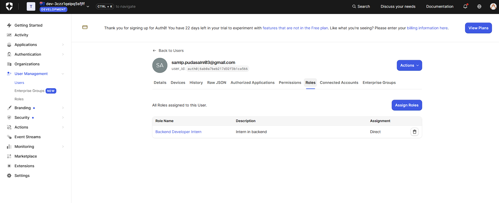

# Tasks

## How role-based access control (RBAC) works in Auth0

Role-based access control (RBAC) is an authorization strategy to assign
permissions to users based on defined roles in an organization. It offers a
simple, manageable approach to access management that is less prone to error
than assigning permissions to users individually.

When using RBAC for Role Management, you analyze the needs of your users and
group them into roles based on common responsibilities. You then assign one or
more roles to each user and one or more permissions to each role. The user-role
and role-permissions relationships make it simple to perform user assignments
since users no longer need to be managed individually, but instead have
privileges that conform to the permissions assigned to their role(s). For
example, if you were using RBAC to control access for an HR application, you
could give HR managers a role that allows them to update employee details, while
other employees would be able to view only their own details. When planning your
access control strategy, it’s best practice to assign users the fewest number of
permissions that allow them to get their work done.

## How to retrieve user roles from Auth0’s access token

You cannot natively read user roles directly from an Auth0 access token because
Auth0's standard access token design maps permissions (permissions) rather than
raw roles (roles) under its Core RBAC implementation.

We can see the user roles from Auth0 dasboard by going to user mangement, and if
the user is added to any role, it can be seen in the Roles heading,


One of the other option is

### Permissions

### Roles as a custom claim

If you need role names in the token, add a post-login Action (Actions -> Flows
-> Login):

```js
exports.onExecutePostLogin = async (event, api) => {
  const namespace = "https://myapp.example.com";
  const roles = event.authorization?.roles ?? [];
  api.accessToken.setCustomClaim(`${namespace}/roles`, roles);
};
```

- The claim name must be namespaced with a URL you control (it doesn't need to
  resolve), or Auth0 silently drops it.
- The user must log in again to get a token with the new claim.

The token then contains:

```json
{
  "sub": "auth0|123",
  "https://myapp.example.com/roles": ["admin"]
}
```

### Reading the claim in NestJS

In the JWT strategy, `validate()` receives the verified payload. Whatever it
returns becomes `req.user`:

```ts
validate(payload: Record<string, any>) {
  return {
    userId: payload.sub,
    permissions: payload.permissions ?? [],
    roles: payload['https://myapp.example.com/roles'] ?? [],
  };
}
```

In a controller:

```ts
@Get('reports')
@UseGuards(AuthGuard('jwt'))
list(@Req() req: { user: { permissions: string[] } }) {
  if (!req.user.permissions.includes('read:reports')) {
    throw new ForbiddenException(); // 403
  }
  return [];
}
```

- Invalid or missing token returns **401** (from `AuthGuard`).
- Valid token but missing permission returns **403** (from check).

### Which one to use

| Approach             | Claim               | Setup                                         | Best for                          |
| -------------------- | ------------------- | --------------------------------------------- | --------------------------------- |
| Permissions          | `permissions`       | Enable RBAC + Add Permissions in Access Token | Authorization checks in the API   |
| Roles (custom claim) | `https://.../roles` | Post-login Action                             | Showing role names, coarse checks |

Prefer permissions for access control. It's the model Auth0 is designed around,
and code doesn't depend on role names.

### Pitfalls

- Never trust a decoded but unverified token. Always verify the signature
  server-side.
- Roles and permissions are a snapshot from login time, so role changes only
  apply when the token is refreshed.
- If `permissions` is empty, check that the user has a role, the role has
  permissions from this API, and the token was requested with the correct
  `audience`.

## Implementing a NestJS guard to enforce RBA

```ts
// roles.decorator.ts
import { SetMetadata } from "@nestjs/common";

export const ROLES_KEY = "roles";
export const Roles = (...roles: string[]) => SetMetadata(ROLES_KEY, roles);
```

```ts
// roles.guard.ts
import { CanActivate, ExecutionContext, Injectable } from "@nestjs/common";
import { Reflector } from "@nestjs/core";
import { ROLES_KEY } from "./roles.decorator";

@Injectable()
export class RolesGuard implements CanActivate {
  constructor(private reflector: Reflector) {}

  canActivate(ctx: ExecutionContext): boolean {
    const required = this.reflector.getAllAndOverride<string[]>(ROLES_KEY, [
      ctx.getHandler(),
      ctx.getClass(),
    ]);
    if (!required?.length) return true; // no @Roles() means any authenticated user

    const { user } = ctx.switchToHttp().getRequest();
    return required.some((role) => user?.roles?.includes(role));
  }
}
```

Usage: In controller:

```ts
@Controller("admin")
@UseGuards(AuthGuard("jwt"), RolesGuard) // authenticate first, then authorize
export class AdminController {
  @Get("users")
  @Roles("admin")
  listUsers() {
    return [];
  }

  @Delete("users/:id")
  @Roles("admin", "superadmin") // any of these roles
  remove() {}
}
```

This relies on validate() in the JWT strategy exposing roles on req.user:
`roles: payload['https://myapp.example.com/roles'] ?? [],`

- Guard order matters. AuthGuard('jwt') must run first, otherwise req.user is
  undefined.
- getAllAndOverride lets a method-level @Roles() override a class-level one.
- Any vs all: some means any listed role is enough. Use every to require all.
- Status codes: returning false gives a 403, and a missing or invalid token
  gives a 401 from AuthGuard.
- Global registration: to apply it everywhere, add { provide: APP_GUARD,
  useClass: RolesGuard } to your module providers. Register the JWT guard the
  same way, before it.

## Protect an API endpoint based on user roles

Using the Roles decorator and RolesGuard from above:

In controller:

```ts
@Controller("admin")
export class AdminController {
  @Get("dashboard")
  @UseGuards(AuthGuard("jwt"), RolesGuard)
  @Roles("admin")
  getDashboard() {
    return { message: "Admins only" };
  }
}
```

There is a shortcut, so we don't need to repeat the three decorators on every
route:

```ts
// auth.decorator.ts
import { applyDecorators, UseGuards } from "@nestjs/common";
import { AuthGuard } from "@nestjs/passport";

export const Auth = (...roles: string[]) =>
  applyDecorators(UseGuards(AuthGuard("jwt"), RolesGuard), Roles(...roles));
```

So we can just use: `@Auth('admin')`

```ts
@Get('dashboard')
@Auth('admin')
getDashboard() {
  return { message: 'Admins only' };
}
```

# Reflection

## How does Auth0 store and manage user roles?

Auth0 stores roles in the tenant, separate from the tokens. Roles are created
under **User Management -> Roles** and assigned to users there (or through the
Management API). Each role can hold **permissions**, which are defined on an API
under **APIs -> your API -> Permissions**. So the relationship is: user -> role
-> permissions.

Roles are not included in the access token by default. There are two ways to get
authorization data into it:

- **Permissions:** enable **RBAC** and **Add Permissions in the Access Token**
  in the API settings. Auth0 then adds a `permissions` claim to the access
  token.
- **Roles as a custom claim:** add a post-login Action that copies
  `event.authorization.roles` into the token under a namespaced claim (e.g.
  `https://myapp.example.com/roles`). Auth0 drops non-namespaced custom claims.

Either way, the token is a snapshot from login time. Role changes in the
dashboard only reach the user after the token is refreshed or they log in again.

## What is the purpose of a guard in NestJS?

A guard decides whether a request may reach a route handler. It implements
`CanActivate` and returns `true` (continue) or `false` (rejected with 403).
Guards run after middleware and before pipes and interceptors, and they have
access to the `ExecutionContext`. That means they can read route metadata (such
as `@Roles('admin')`) through `Reflector`.

Guards keep authorization out of business logic. Instead of repeating an `if`
check in every handler, the rule is declared once as a decorator and enforced in
one place. In this setup, `AuthGuard('jwt')` handles authentication (who are
you? -> 401) and `RolesGuard` handles authorization (are you allowed? -> 403).

## How would you restrict access to an API endpoint based on user roles?

1. Expose the roles on `req.user` in the JWT strategy's `validate()`:

```ts
validate(payload: Record<string, any>) {
  return {
    userId: payload.sub,
    roles: payload['https://myapp.example.com/roles'] ?? [],
  };
}
```

2. Create a `@Roles()` decorator that stores the required roles as metadata.
3. Create a `RolesGuard` that reads that metadata and compares it with
   `req.user.roles`:

```ts
canActivate(ctx: ExecutionContext): boolean {
  const required = this.reflector.getAllAndOverride<string[]>(ROLES_KEY, [
    ctx.getHandler(),
    ctx.getClass(),
  ]);
  if (!required?.length) return true;
  const { user } = ctx.switchToHttp().getRequest();
  return required.some((role) => user?.roles?.includes(role));
}
```

4. Apply both guards to the endpoint, authentication first:

```ts
@Get('dashboard')
@UseGuards(AuthGuard('jwt'), RolesGuard)
@Roles('admin')
getDashboard() {
  return { message: 'Admins only' };
}
```

Result: no or invalid token gives 401, a valid token without the `admin` role
gives 403, and an admin gets 200.

## What are the security risks of improper authorization, and how can they be mitigated?

Broken access control is the top item in the OWASP Top 10. Main risks and
mitigations:

| Risk                                                          | Mitigation                                                                                                         |
| ------------------------------------------------------------- | ------------------------------------------------------------------------------------------------------------------ |
| Endpoint left unprotected by mistake                          | Register the auth guards globally (`APP_GUARD`) and opt out with a `@Public()` decorator, so the default is closed |
| Trusting an unverified token                                  | Always verify signature, `iss`, `aud` and expiry server-side (JWKS + `passport-jwt`)                               |
| Enforcing access only in the frontend                         | Hiding UI is cosmetic. The API must enforce every rule                                                             |
| Privilege escalation (users getting roles they shouldn't)     | Assign roles only from the Auth0 dashboard or a restricted Management API client, never from user input            |
| Stale roles after a role is removed                           | Use short token lifetimes and refresh tokens so changes apply quickly                                              |
| Horizontal access (user A reading user B's data, IDOR)        | Roles aren't enough. Also check ownership of the resource in the handler or service                                |
| Over-broad roles                                              | Least privilege: fine-grained permissions like `read:reports` instead of a catch-all `admin`                       |
| Silent misconfiguration (wrong claim name, missing namespace) | Fail closed: with no roles the guard denies access. Test both the allowed and denied cases                         |

Overall: verify every token, deny by default, enforce on the server, and grant
only the minimum access needed.
