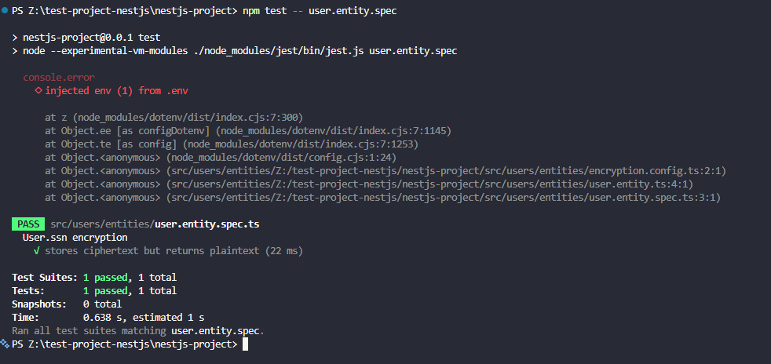

# Field-Level Encryption in NestJS with `typeorm-encrypted`

## Research: how `typeorm-encrypted` works and why it's needed

`typeorm-encrypted` encrypts individual entity fields inside the application
before they are written to the database, and decrypts them when they are read
back. The database only ever stores ciphertext for those columns.

It hooks into TypeORM in two ways:

- **Transformers** (`EncryptionTransformer`, `JSONEncryptionTransformer`): a
  TypeORM column `transformer` whose `to()` encrypts on save and `from()`
  decrypts on load.
- **Subscriber** (`ExtendedColumnOptions` + `AutoEncryptSubscriber`): mark a
  column with an `encrypt` option and register the subscriber on the connection;
  it encrypts and decrypts around save and fetch.

Both use symmetric encryption from Node's `crypto` module (e.g. `aes-256-cbc` or
`aes-256-gcm`) with a secret key.

**Why it's needed:** database-level encryption (disk or TDE) protects against a
stolen disk or backup, but anyone who can query the database (a leaked
connection string, SQL injection, an over-privileged admin, a log or dump) still
sees plaintext. Encrypting the field in the application means the database never
holds the readable value.

## Implement in a NestJS entity

```bash
npm i typeorm-encrypted dotenv
```

Generate a 32-byte key (64 hex characters for AES-256) and keep it out of git:

```bash
node -e "console.log(require('crypto').randomBytes(32).toString('hex'))"
```

```
# .env (git-ignored)
ENCRYPTION_KEY=<64 hex characters>
```

```ts
// encryption.config.ts
import "dotenv/config"; // entities load before ConfigModule, so load env here

if (!process.env.ENCRYPTION_KEY) {
  throw new Error("ENCRYPTION_KEY is not set");
}

export const encryptionConfig = {
  key: process.env.ENCRYPTION_KEY,
  algorithm: "aes-256-cbc",
  ivLength: 16,
};
```

```ts
// user.entity.ts
import { Column, Entity, PrimaryGeneratedColumn } from "typeorm";
import { EncryptionTransformer } from "typeorm-encrypted";
import { encryptionConfig } from "./encryption.config";

@Entity("users")
export class User {
  @PrimaryGeneratedColumn()
  id: number;

  @Column()
  email: string; // stays plaintext (searchable)

  @Column({
    type: "varchar",
    nullable: true,
    transformer: new EncryptionTransformer(encryptionConfig),
  })
  ssn: string; // encrypted before it reaches the database
}
```

No other change is needed in services: `repo.save()` and `repo.find()` work as
normal and the field is encrypted or decrypted automatically.

Alternative: use
`@Column(<ExtendedColumnOptions>{ type: 'varchar', encrypt: {...} })` and
register `AutoEncryptSubscriber` in `subscribers` when configuring
`TypeOrmModule.forRoot()`.

## How encryption keys are managed and stored

- The key is **not** in the entity or the repo. It is read from an environment
  variable (`process.env.ENCRYPTION_KEY`), which the package's own docs
  recommend over hard-coding.
- Locally it lives in a git-ignored `.env`. Commit only `.env.example` with a
  placeholder.
- In production it should come from a secret manager (e.g. AWS Secrets Manager,
  GCP Secret Manager, Azure Key Vault) injected at deploy time, and be stored
  separately from the database and its backups. Someone who steals a DB backup
  should not also get the key.
- Use a different key per environment (dev, staging, prod).
- If the key is lost, the data is unrecoverable. If it leaks, all data encrypted
  with it is exposed.
- **Rotation:** changing the key means existing rows can't be decrypted with the
  new one. Decrypt with the old key and re-encrypt with the new key in a
  migration or script, and take a backup first.

## Test encrypting and decrypting a field

The check is: the repository returns plaintext, but a raw SQL query shows
ciphertext.

Install: `npm i -D sql.js`

```ts
// user.entity.spec.ts
import { DataSource } from "typeorm";
import { User } from "./user.entity";

describe("User.ssn encryption", () => {
  let ds: DataSource;

  beforeAll(async () => {
    ds = new DataSource({
      type: "sql.js",
      entities: [User],
      synchronize: true,
    });
    await ds.initialize();
  });

  afterAll(() => ds.destroy());

  it("stores ciphertext but returns plaintext", async () => {
    const repo = ds.getRepository(User);
    const saved = await repo.save({ email: "a@b.com", ssn: "123-45-6789" });

    // through TypeORM: decrypted
    const found = await repo.findOneByOrFail({ id: saved.id });
    expect(found.ssn).toBe("123-45-6789");

    // raw SQL: encrypted
    const [raw] = await ds.query("SELECT ssn FROM users WHERE id = ?", [
      saved.id,
    ]);
    expect(raw.ssn).not.toBe("123-45-6789");
    expect(raw.ssn).not.toContain("6789");
  });
});
```

Set `ENCRYPTION_KEY` for tests (e.g. `setupFiles` in the Jest config that
assigns a dummy 64-hex-character key), and install `sqlite3` as a dev
dependency. Manual check: save a row, then run `SELECT ssn FROM users` in the DB
client and confirm the value is unreadable.

Run test using: `npm test -- user.entity.spec`

result:
```
PS Z:\test-project-nestjs\nestjs-project> npm test -- user.entity.spec

> nestjs-project@0.0.1 test
> node --experimental-vm-modules ./node_modules/jest/bin/jest.js user.entity.spec

  console.error
    ◇ injected env (1) from .env

      at z (node_modules/dotenv/dist/index.cjs:7:300)
      at Object.ee [as configDotenv] (node_modules/dotenv/dist/index.cjs:7:1145)
      at Object.te [as config] (node_modules/dotenv/dist/index.cjs:7:1253)
      at Object.<anonymous> (node_modules/dotenv/dist/config.cjs:1:24)
      at Object.<anonymous> (src/users/entities/Z:/test-project-nestjs/nestjs-project/src/users/entities/encryption.config.ts:2:1)
      at Object.<anonymous> (src/users/entities/Z:/test-project-nestjs/nestjs-project/src/users/entities/user.entity.ts:4:1)
      at Object.<anonymous> (src/users/entities/Z:/test-project-nestjs/nestjs-project/src/users/entities/user.entity.spec.ts:3:1)

 PASS  src/users/entities/user.entity.spec.ts
  User.ssn encryption
    √ stores ciphertext but returns plaintext (22 ms)

Test Suites: 1 passed, 1 total
Tests:       1 passed, 1 total
Snapshots:   0 total
Time:        0.638 s, estimated 1 s
Ran all test suites matching user.entity.spec.
PS Z:\test-project-nestjs\nestjs-project> 
```


## Reflection

### Why does Focus Bear double encrypt sensitive data instead of relying on database encryption alone?

Database encryption (disk or managed-DB encryption at rest) only protects the
storage layer: a stolen disk, snapshot or backup. Once the database is running
and someone connects, it transparently decrypts everything, so it does nothing
against SQL injection, a leaked connection string, an over-privileged account,
or data appearing in logs and dumps.

Application-level encryption adds a second, independent layer (defense in
depth). The database receives ciphertext, and the key lives outside the
database, so getting into the database alone is not enough to read the sensitive
fields. This matters especially for a product like Focus Bear's, where users
share personal data and expect it to stay private. If one layer fails, the other
still protects the data.

### How does `typeorm-encrypted` integrate with TypeORM entities?

It plugs into TypeORM's existing extension points, so entities and services stay
almost unchanged. With the transformer approach, a column gets
`transformer: new EncryptionTransformer({...})`, and TypeORM calls it to encrypt
the value when writing and decrypt it when reading. With the subscriber
approach, a column declares an `encrypt` option and `AutoEncryptSubscriber`
handles it around save and fetch. Either way, `repository.save()` and
`repository.find()` are used as usual and the code sees plaintext, while the
database sees ciphertext.

### What are the best practices for securely managing encryption keys?

- Never hard-code or commit keys. Load them from environment variables or,
  better, a secret manager or KMS.
- Store keys separately from the data and its backups.
- Use a separate key per environment, and generate them with a secure random
  generator (32 random bytes for AES-256).
- Restrict who and what can read the key (least privilege) and audit access.
- Plan for rotation: keep a way to re-encrypt existing data with a new key.
- Back the key up securely, since losing it means losing the data.
- Don't log keys or decrypted values.

### What are the trade-offs between encrypting at the database level vs. the application level?

|                  | Database level (TDE, disk encryption)           | Application level (`typeorm-encrypted`)                                                                |
| ---------------- | ----------------------------------------------- | ------------------------------------------------------------------------------------------------------ |
| Protects against | Stolen disks, snapshots, backups                | Also DB compromise, SQL injection, curious admins, leaked dumps                                        |
| Effort           | Mostly configuration, transparent to code       | Code changes, key management in the app                                                                |
| Querying         | Everything works (search, sort, indexes, joins) | Can't filter, sort or search on encrypted columns, because the transformation happens outside the DBMS |
| Performance      | Small overhead in the database                  | Encryption cost in the app on every read and write                                                     |
| Key control      | Often held by the cloud provider or DB          | Held by you, which is more control and more responsibility                                             |
| Scope            | Whole database                                  | Only the fields you choose                                                                             |

Because of these trade-offs, encrypt only the genuinely sensitive fields at the
application level, keep searchable fields like email in plaintext, and use
database-level encryption as the baseline for everything else. Using both is the
double-encryption approach.
