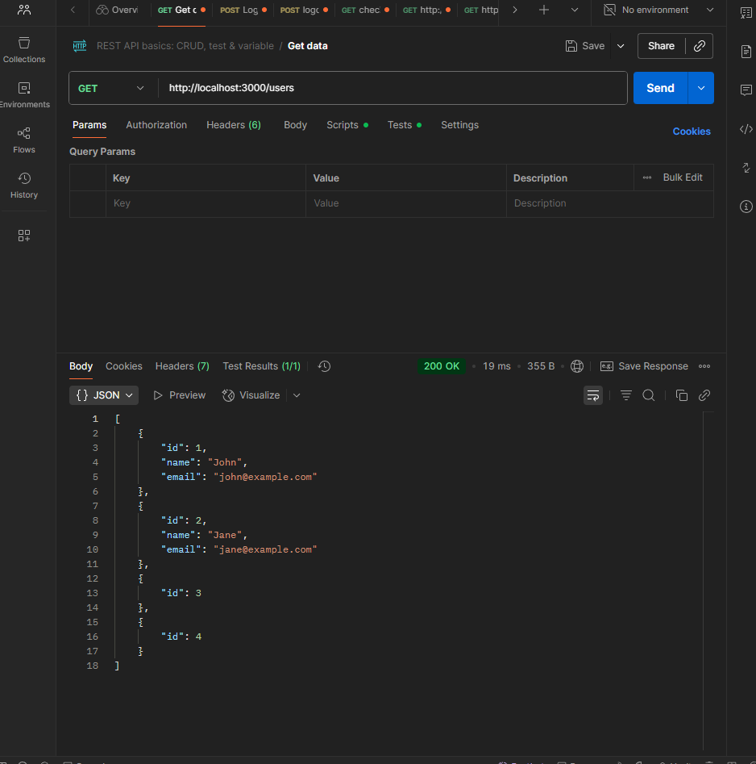
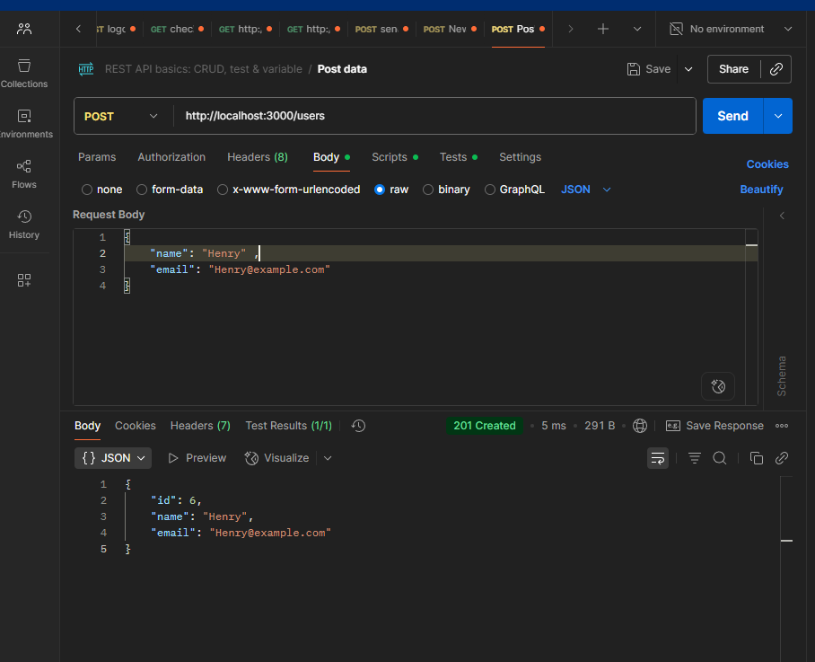
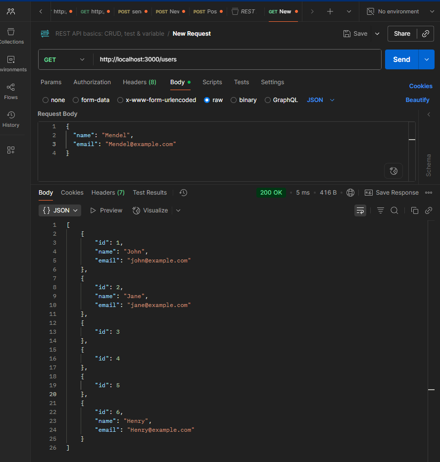
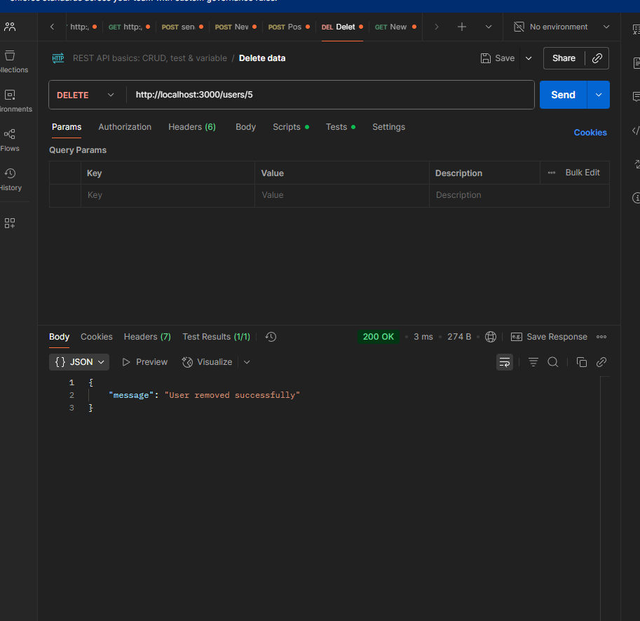

# Creating a crud controller in NestJS

```TS
// users.controller.ts
import {
  Controller,
  Get,
  Post,
  Put,
  Delete,
  Param,
  Body,
} from '@nestjs/common';
import { UsersService } from './users.service';

@Controller('users')
export class UsersController {
  constructor(private readonly usersService: UsersService) {}

  @Get()
  findAll() {
    return this.usersService.findAll();
  }

  @Get(':id')
  findOne(@Param('id') id: string) {
    return this.usersService.findOne(Number(id));
  }

  @Post()
  create(@Body() user: { name: string; email: string }) {
    return this.usersService.create(user);
  }

  @Put(':id')
  update(
    @Param('id') id: string,
    @Body() user: { name: string; email: string },
  ) {
    return this.usersService.update(Number(id), user);
  }

  @Delete(':id')
  remove(@Param('id') id: string) {
    return this.usersService.remove(Number(id));
  }
}
```

```TS
//users.module.ts
import { Module } from '@nestjs/common';
import { UsersController } from './users.controller';
import { UsersService } from './users.service';

@Module({
  controllers: [UsersController],
  providers: [UsersService],
})
export class UsersModule {}
```

```TS
//users.service.ts
import { Injectable } from '@nestjs/common';

@Injectable()
export class UsersService {
  private users: { id: number; name: string; email: string }[] = [
    { id: 1, name: 'John', email: 'john@example.com' },
    { id: 2, name: 'Jane', email: 'jane@example.com' },
  ];

  findAll() {
    return this.users;
  }

  findOne(id: number) {
    return this.users.find((user) => user.id === id);
  }

  create(user: { name: string; email: string }) {
    const newUser = {
      id: this.users.length + 1,
      ...user,
    };
    this.users.push(newUser);
    return newUser;
  }

  update(id: number, user: { name: string; email: string }) {
    const index = this.users.findIndex((u) => u.id === id);
    if (index !== -1) {
      this.users[index] = { id, ...user };
      return this.users[index];
    } else {
      return { message: 'User not found' };
    }
  }

  remove(id: number) {
    this.users = this.users.filter((user) => user.id !== id);

    return { message: 'User removed successfully' };
  }
}

```

## Test result images in postman
  


# NestJS REST API Reflection

## What is the role of a controller in NestJS?

A controller is responsible for handling incoming HTTP requests and returning
responses. It defines the routes that clients can access and determines which
method should handle each request. In my implementation, the UsersController
handles requests such as GET /users, POST /users, PUT /users/:id, and DELETE
/users/:id.

NestJS uses decorators such as @Get(), @Post(), @Put(), and @Delete() to define
these routes.

## How should business logic be separated from the controller?

The controller should mainly handle the HTTP layer, such as receiving request
parameters and request bodies. The actual application or business logic shopuld
be placed in a service.

In my implemetation, the UsersCOntroller receives the request and passes the
operation to UsersService. The service is responsible for finding, creating,
updating, and deleting users.

This keeps the controller smaller and separates the responsibilities of each
part of the application.

## Why is it important to use services instead of handling logic inside controllers?

Using services prevents controllers from becoming too large and difficult to
maintain. Services can also be reused by different controllers or other parts of
the application.

Separating the business logic makes the application easier to test because the
service can be tested independently from the HTTP layer. It also makes it easier
to replace or modify the underlying logic later, such as changing from an
in-memory array to a database.

NestJS's documentation describes the typical CRUD flow as controllers handling
HTTP requests and delegating tasks to services, with most business logic
residing in the service layer.

## How does NestJS automatically map request methods (GET, POST, etc.) to handlers?

NestJS uses decorators to create its routing map. The @Controller() decorator
defines the base route, while decorators such as @Get(), @Post(), @Put(), and
@Delete() specify the HTTP method and additional route path.

The `@Controller('users')` creates the `/users `prefix. Therefore, `@Get()` maps
to `GET /users`, while `@Get(':id')` maps to `GET /users/:id.`

NestJS reads these decorators when the application starts and creates the routing map automatically. The method names themselves are not what determine the routes; the decorators define how HTTP requests are mapped to the methods.