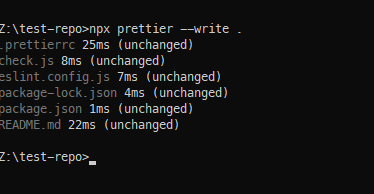
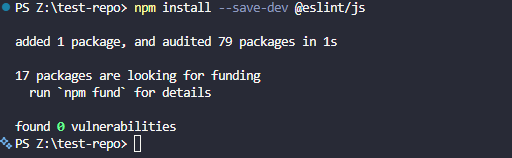
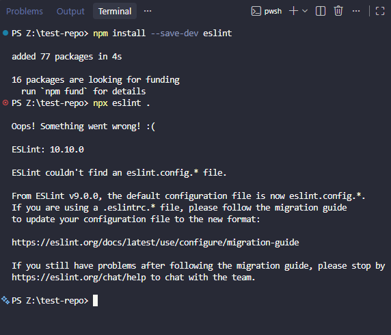
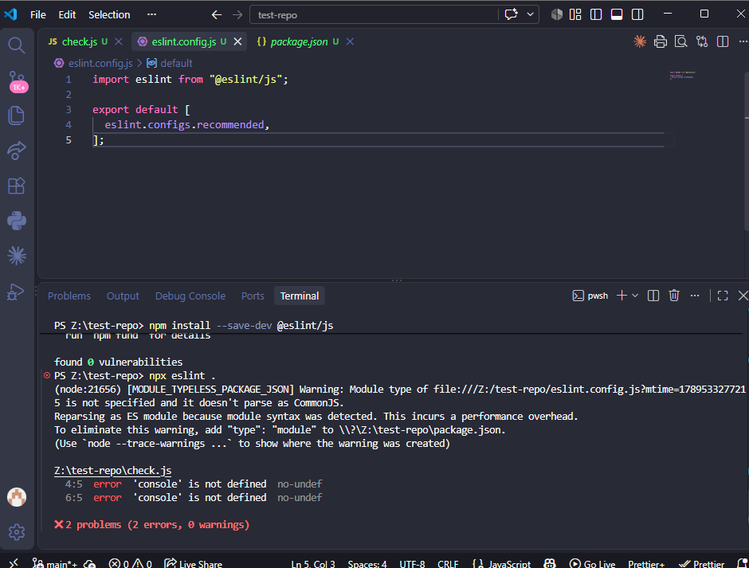
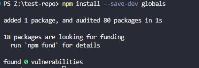
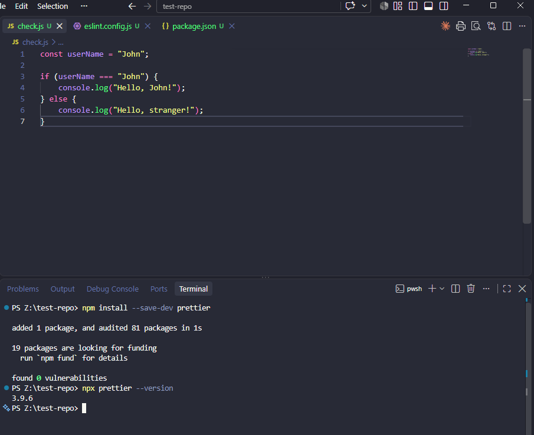
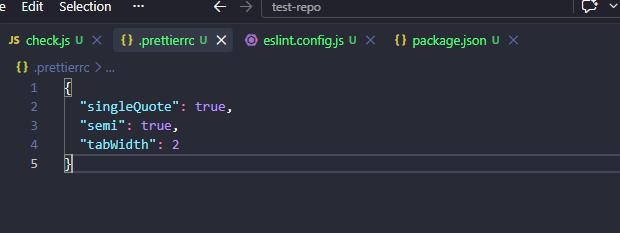
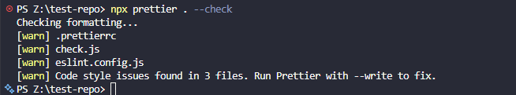
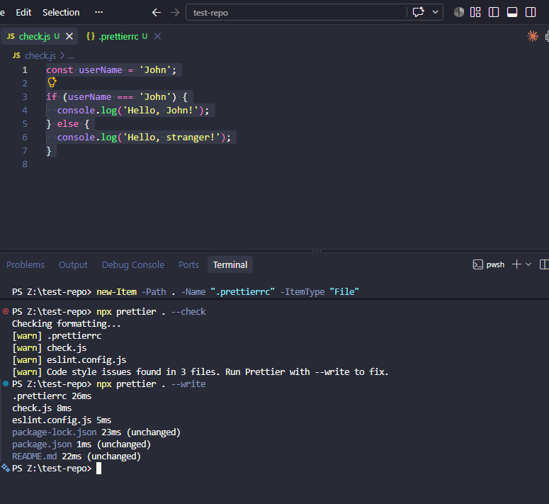

## Install and Configure ESLint

> **Note:** All install commands, config file contents, and command outputs are
> included below in fenced code blocks. If these are not rendering in your view,
> please check the raw markdown file directly.

I installed ESLint as a development dependency in the project so that the code
could be checked against consistent JavaScript coding standards.

I used the following command:

```bash
npm install --save-dev eslint
npm install --save-dev @eslint/js
```

\


I then created an ESLint configuration using the current flat configuration
format. I configured ESLint to follow the Airbnb JavaScript style guide and
added the required rules and settings for the project.

After configuring ESLint, I tested the setup by running:

```bash
npx eslint .
```



```text
Oops! Something went wrong! :(

ESLint: 10.10.0

ESLint couldn't find an eslint.config.* file.

From ESLint v9.0.0, the default configuration file is now eslint.config.*.
If you are using a .eslintrc.* file, please follow the migration guide
to update your configuration file to the new format:

https://eslint.org/docs/latest/use/configure/migration-guide

If you still have problems after following the migration guide, please stop by
https://eslint.org/chat/help to chat with the team.

```

This issue was regarding the eslint file where you put in what needs to be
actually lint checked. You can configure, but was missing from mine.

Created an eslint.config.js file:

Initial file:

```js
//eslint.config.js
import eslint from "@eslint/js";

export default [eslint.configs.recommended];
```



**Issue:**

```
PS Z:\test-repo> npx eslint .
(node:21656) [MODULE_TYPELESS_PACKAGE_JSON] Warning: Module type of file:///Z:/test-repo/eslint.config.js?mtime=1789533277215 is not specified and it doesn't parse as CommonJS.
Reparsing as ES module because module syntax was detected. This incurs a performance overhead.
To eliminate this warning, add "type": "module" to \\?\Z:\test-repo\package.json.
(Use `node --trace-warnings ...` to show where the warning was created)

Z:\test-repo\check.js
  4:5  error  'console' is not defined  no-undef
  6:5  error  'console' is not defined  no-undef

✖ 2 problems (2 errors, 0 warnings)
```

**FIX**

Added node globals package using `npm install --save-dev globals`



eslint.config.js fix

```js
//eslint.config.js
import eslint from "@eslint/js";
import globals from "globals";

export default [
  eslint.configs.recommended,
  {
    languageOptions: {
      globals: globals.node,
    },
  },
];
```

Added the node global package, so now eslint knows that console is included.

now running `npx eslint .` It shows nothing which means there are no errors.


## Install and Configure Prettier

I installed Prettier as a development dependency to automatically format the
project's code consistently.

I used the following command:

npm install --save-dev prettier



I then configured Prettier for the project so that formatting such as
indentation, line breaks, spacing, and other formatting conventions would remain
consistent.

Then added the `.prettierrc` file to keeo the formatting config I want.



```
{
  "singleQuote": true,
  "semi": true,
  "tabWidth": 2
}
```

I tested the configuration by running:

npx prettier . --check



```
PS Z:\test-repo> npx prettier . --check
Checking formatting...
[warn] .prettierrc
[warn] check.js
[warn] eslint.config.js
[warn] Code style issues found in 3 files. Run Prettier with --write to fix.
PS Z:\test-repo>
```

Prettier can also automatically format the project using:

npx prettier . --write



terminal output

```
PS Z:\test-repo> npx prettier . --write
.prettierrc 26ms
check.js 8ms
eslint.config.js 5ms
package-lock.json 23ms (unchanged)
package.json 1ms (unchanged)
README.md 22ms (unchanged)
PS Z:\test-repo>
```

**Initial file:**

```js
const userName = "John";

if (userName === "John") {
  console.log("Hello, John!");
} else {
  console.log("Hello, stranger!");
}
```

**Final file:**

```js
const userName = "John";

if (userName === "John") {
  console.log("Hello, John!");
} else {
  console.log("Hello, stranger!");
}
```

the double quotes was changed to singleQuote

#### Reflection on Readability

Running ESLint and Prettier together noticeably improved the consistency of the
codebase. ESLint caught actual logic issues (the no-undef errors for console)
that could have caused bugs if left unnoticed, while Prettier handled the
surface-level formatting — converting double quotes to single quotes, and
standardizing indentation and semicolon usage. On their own these changes seem
minor, but consistent formatting across every file means a developer reading the
code doesn't have to mentally parse a mix of styles, making it easier to spot
real errors rather than get distracted by inconsistent syntax. It also makes
future diffs cleaner in version control, since changes reflect actual logic
edits rather than formatting differences between contributors.

Resubmission note: clean_code.md includes ESLint/Prettier install commands,
config contents, and command outputs in fenced code blocks. Previous review
appears to have missed these — verified they render correctly in the raw GitHub
view.