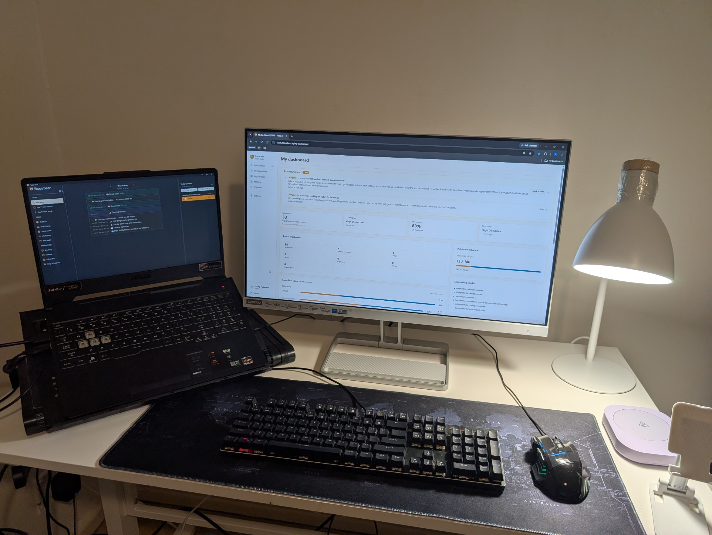
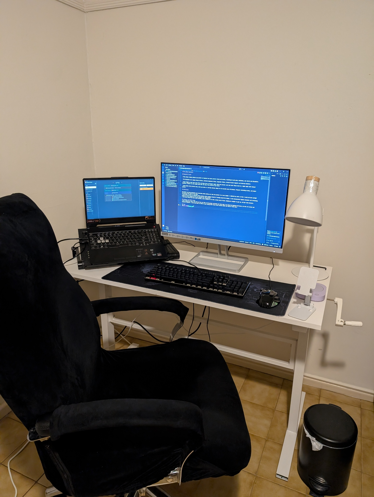

# OHS Laptop Ergonomics

## Research & Learn 

- Only using a laptop without any monitor or keyboard can cause posture issues and strain, resulting in neck pain, backaches, eye strain and discomfort.

- The essentials are: Laptop Stands & Risers, External Keyboards & Mice, Ergonomic Chairs, Forearm & Wrist Supports and External Monitors.

- Chair height so your feet rests flat and knees form a 90 degree angle. Desk and armrests such that your elbows bend at a right angle with relaxed shoulders. Monitor at arms length away with the top of the screen at eye level.

- Daily habits like 20-20-20 rule, where you look at a 20-foot distant object for 20 seconds every 20 minutes. Frequent stretching breaks, and proper posture.

## Reflections
My monitor and desk placement were already suitable, while making sure that the monitor was approximately an arm's length away. I adjusted my chair so that I could sit more upright and keep my feet flat on the floor.

I have made an effort to maintain better posture while working instead of leaning towards the laptop. I also incorporated regular movement and stretching breaks to avoid staying in the same position for long periods.

I have been using Focus Bear while working, which reminds me to take a break every 25 minutes. This helps me remember to get up and move around regularly.

## Workplace and Habit Change
I adjusted my chair so that my feet are flat on the floor and made sure that when I am using the keyboard and mouse, my arms are supported and my elbows are at approximately 90 degrees. I have also made an effort to get moving after every focus session with the help of Focus Bear.

## Task

### TASK_REFLECTION
After completing the task, I made several changes to improve my workspace and reduce strain while working. I adjusted my chair so that my feet remain flat on the floor and my elbows are positioned at approximately 90 degrees when using the keyboard and mouse. I also made sure my monitor was positioned at a comfortable height and approximately an arm's length away.

One of the main behavioural changes I made was being more aware of my posture. Instead of leaning towards the screen, I made an effort to sit upright and keep my shoulders relaxed. I also started taking regular movement and stretching breaks so that I was not sitting in the same position for too long.

I used Focus Bear throughout my work sessions to remind me to take a break every 25 minutes. This helped me remember to get up, move around and reset my posture. I found that these reminders made it easier to take regular breaks without having to remember them myself.

Overall, the changes made my workspace more comfortable and helped me become more aware of my posture and movement habits. I will continue using Focus Bear and maintaining these ergonomic adjustments when working for longer periods.