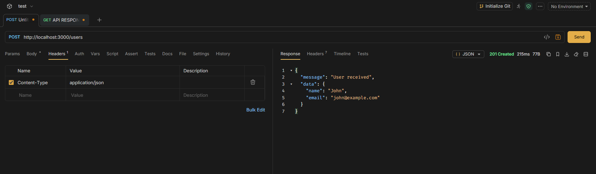
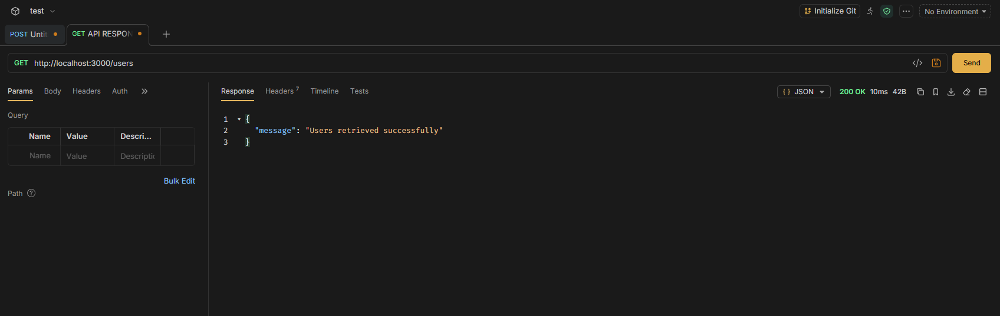
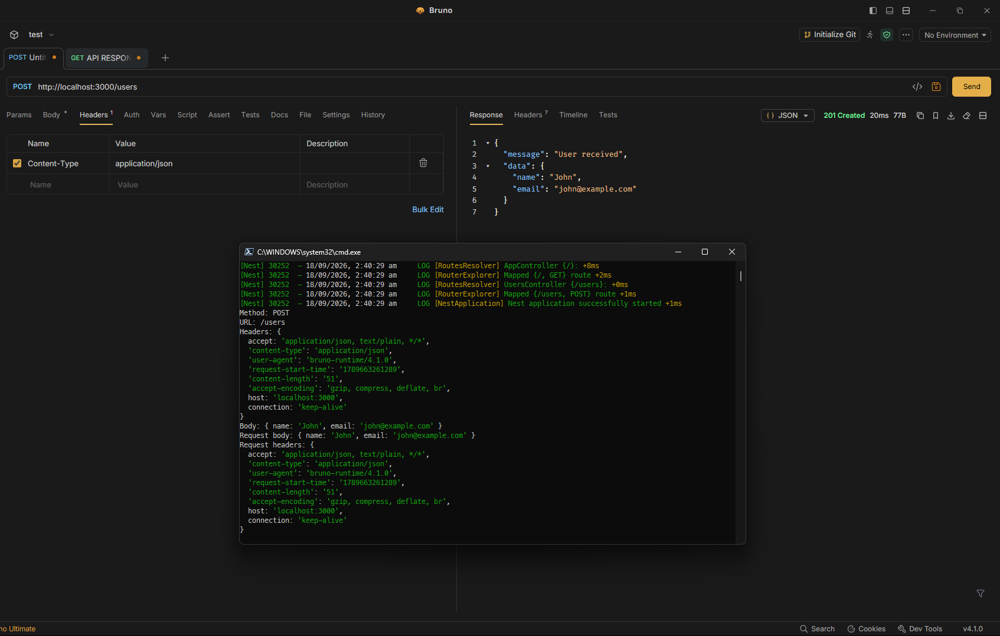
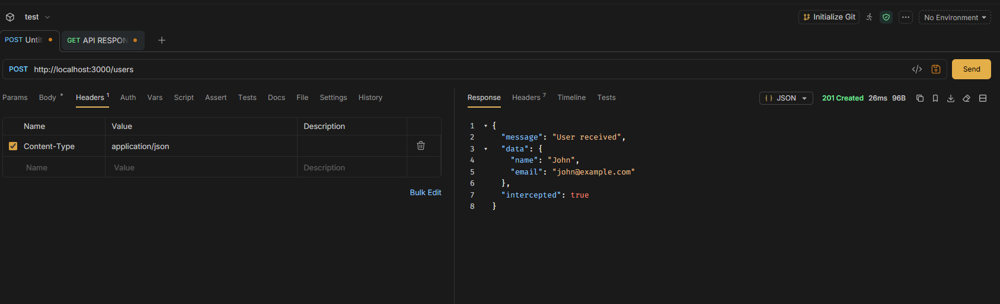

# Research tools for inspecting API requests (Bruno, Postman, or curl)

| Feature                 | Bruno                                                       | Postman                                   | cURL                                               |
| ----------------------- | ----------------------------------------------------------- | ----------------------------------------- | -------------------------------------------------- |
| **Interface**           | Graphical UI                                                | Graphical UI                              | Command line                                       |
| **Request creation**    | Easy to create and organise requests                        | Easy to create and organise requests      | Written as commands                                |
| **Request inspection**  | Headers, body, parameters, authentication                   | Headers, body, parameters, authentication | Displays request/response through terminal options |
| **Response inspection** | Response body, headers, status code                         | Response body, headers, status code       | Response body, headers, status code                |
| **Collections**         | Collections stored as files                                 | Collections managed within Postman        | No built-in collection system                      |
| **Git/version control** | Well suited because requests can be stored as project files | Possible, but less file-oriented          | Commands can be stored in scripts/files            |
| **Ease of use**         | Beginner-friendly                                           | Beginner-friendly                         | Requires command-line knowledge                    |
| **Automation**          | Can be used with scripts and CLI                            | Strong testing and automation features    | Very useful for shell scripts and automation       |
| **Best suited for**     | Development and Git-based API testing                       | API testing, collaboration and automation | Quick requests, scripting and command-line testing |

# Logging Request Payloads and Headers in NestJS

```ts
//users.controller.ts
import { Controller, Post, Req } from "@nestjs/common";
import type { Request } from "express";

@Controller("users")
export class UsersController {
  @Post()
  createUser(@Req() request: Request) {
    console.log("Request body:", request.body);
    console.log("Request headers:", request.headers);

    return {
      message: "User received",
      data: request.body,
    };
  }
}
```

**IN BRUNO** `POST http://localhost:3000/users`

add body as:

```
{
  "name": "John",
  "email": "john@example.com"
}
```

And header as: `Content-Type: application/json`

output is: 

`201 created`

```
{
  "message": "User received",
  "data": {
    "name": "John",
    "email": "john@example.com"
  }
}
```

# Inspecting API Responses and HTTP Status Codes

Bruno can be used to inspect the response returned by the NestJS API.

```ts
//users.controller.ts
import { Controller, Get, HttpStatus, Res } from "@nestjs/common";
import type { Response } from "express";

@Controller("users")
export class UsersController {
  @Get()
  getUsers(@Res() response: Response) {
    response.status(HttpStatus.OK).json({
      message: "Users retrieved successfully",
    });
  }
}
```

Output 

Shows status as 200 ok

# Use middleware or interceptors to modify and analyze API responses

Middleware runs first, then controller, then interceptor.

## Middleware

```ts
//users.controller.ts

import { Controller, Post, Req, UseInterceptors } from "@nestjs/common";
import type { Request } from "express";
//import { ResponseLoggerInterceptor } from './users.Interceptors';

@Controller("users")
//@UseInterceptors(ResponseLoggerInterceptor)
export class UsersController {
  @Post()
  createUser(@Req() request: Request) {
    console.log("Request body:", request.body);
    console.log("Request headers:", request.headers);

    return {
      message: "User received",
      data: request.body,
    };
  }
}
```

```ts
//users.middleware.ts

import { Injectable, NestMiddleware } from "@nestjs/common";
import { Request, Response, NextFunction } from "express";

@Injectable()
export class LoggerMiddleware implements NestMiddleware {
  use(request: Request, response: Response, next: NextFunction) {
    console.log("Method:", request.method);
    console.log("URL:", request.url);
    console.log("Headers:", request.headers);
    console.log("Body:", request.body);

    next();
  }
}
```

For app.module.ts

```ts
//app.module.ts
import { Module, MiddlewareConsumer } from "@nestjs/common";
import { AppController } from "./app.controller";
import { AppService } from "./app.service";
import { UsersController } from "./users/users.controller";
import { LoggerMiddleware } from "./users/users.middleware";

@Module({
  imports: [],
  controllers: [AppController, UsersController],
  providers: [AppService],
})
export class AppModule {
  //Run LoggerMiddleware whenever a request is made to a route handled by UsersController.
  configure(consumer: MiddlewareConsumer) {
    consumer.apply(LoggerMiddleware).forRoutes(UsersController);
  }
}
```

After testing in Bruno: 

the terminal showed:

```
Method: POST
URL: /users
Headers: {
  accept: 'application/json, text/plain, */*',
  'content-type': 'application/json',
  'user-agent': 'bruno-runtime/4.1.0',
  'request-start-time': '1789663261289',
  'content-length': '51',
  'accept-encoding': 'gzip, compress, deflate, br',
  host: 'localhost:3000',
  connection: 'keep-alive'
}
Body: { name: 'John', email: 'john@example.com' }
Request body: { name: 'John', email: 'john@example.com' }
Request headers: {
  accept: 'application/json, text/plain, */*',
  'content-type': 'application/json',
  'user-agent': 'bruno-runtime/4.1.0',
  'request-start-time': '1789663261289',
  'content-length': '51',
  'accept-encoding': 'gzip, compress, deflate, br',
  host: 'localhost:3000',
  connection: 'keep-alive'
}
```

Middleware is running properly

## Interceptor

```ts
//users.controller.ts
import { Controller, Post, Req, UseInterceptors } from "@nestjs/common";
import type { Request } from "express";
import { ResponseLoggerInterceptor } from "./users.Interceptors";

@Controller("users")
@UseInterceptors(ResponseLoggerInterceptor)
export class UsersController {
  @Post()
  createUser(@Req() request: Request) {
    console.log("Request body:", request.body);
    console.log("Request headers:", request.headers);

    return {
      message: "User received",
      data: request.body,
    };
  }
}
```

```ts
//user.interceptors.ts

import {
  CallHandler,
  ExecutionContext,
  Injectable,
  NestInterceptor,
} from "@nestjs/common";
import { Observable, map } from "rxjs";

@Injectable()
export class ResponseLoggerInterceptor implements NestInterceptor {
  intercept(context: ExecutionContext, next: CallHandler): Observable<any> {
    return next.handle().pipe(
      map((data) => {
        console.log("Original response:", data);

        return {
          ...data,
          intercepted: true,
        };
      }),
    );
  }
}
```

Now testing: in bruno



Now here: The response data comes from ResponseLoggerInterceptor

```
{
  "message": "User received",
  "data": {
    "name": "John",
    "email": "john@example.com"
  },
  "intercepted": true
}
```

The interceptor is used to inspect or modify the response before it is sent back
to the client. In this example, the `UsersController` first creates the response
containing the message and user data. The `ResponseLoggerInterceptor` then
receives this response and can log it for debugging or analysis. It can also
modify the response, such as adding an `intercepted: true` property, before the
response reaches Bruno. Interceptors can use the same response-handling logic to
multiple endpoints without having to repeat the code in every controller.

# Reflection

## How can logging request payloads help with debugging?

Logging request payloads helps identify what data is actually being sent to the
API. This makes it easier to find problems such as missing fields, incorrect
values, or unexpected data formats.

For example, when I sent a POST request from Bruno, the NestJS terminal showed:

```text
Body: { name: 'John', email: 'john@example.com' }
```

This confirmed that the request body was reaching the server correctly. Logging
request headers can also help identify issues with content types, authentication
headers, or other request information.

However, sensitive information such as passwords, authentication tokens, API
keys, and personal information should not be logged.

## What tools can you use to inspect API requests and responses?

The main tools I researched were Bruno, Postman, and cURL.

Bruno and Postman provide graphical interfaces where requests can be created and
the request body, headers, authentication, response body, and HTTP status code
can be inspected easily. Bruno also stores collections as files, which makes it
convenient for Git-based projects.

cURL is a command-line tool that can send HTTP requests and display responses
directly in the terminal. It is useful for quick testing and scripting.

For this task, I used Bruno to send requests to my NestJS API and inspect the
responses and status codes.

## How would you debug an issue where an API returns the wrong status code?

I would first reproduce the problem using a tool such as Bruno, Postman, or cURL
and check the status code returned by the API.

I would then check the controller and the code responsible for generating the
response. I would use logging or VS Code breakpoints to determine which endpoint
is being executed and what response is being returned.

For example, I used:

```ts
response.status(HttpStatus.OK).json({
  message: "Users retrieved successfully",
});
```

to explicitly return a `200 OK` response.

I would also check whether an exception, middleware, interceptor, guard, or
other part of the request pipeline is changing the response. Comparing the
expected status code with the actual status code in Bruno helps identify where
the problem occurs.

### Common status code:

| Status Code | Meaning                        |
| ----------- | ------------------------------ |
| `200`       | Request successful             |
| `201`       | Resource created               |
| `400`       | Bad request                    |
| `401`       | Authentication required/failed |
| `403`       | Forbidden                      |
| `404`       | Resource not found             |
| `500`       | Internal server error          |

## What are some security concerns when logging request data?

Request logging can expose sensitive information if the entire request body or
headers are logged without filtering.

Examples of sensitive data include:

- Passwords
- Authentication tokens
- API keys
- Session cookies
- Personal information
- Payment information

For this reason, sensitive fields should be removed or masked before logging.
Logging should also be limited in production and logs should be stored securely
with appropriate access controls.

In my testing, logging the request body and headers was useful for debugging,
but I would avoid logging sensitive values in a real application.
