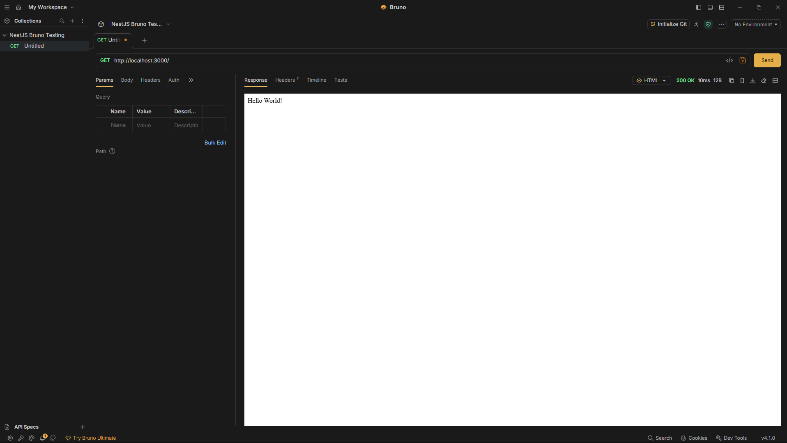
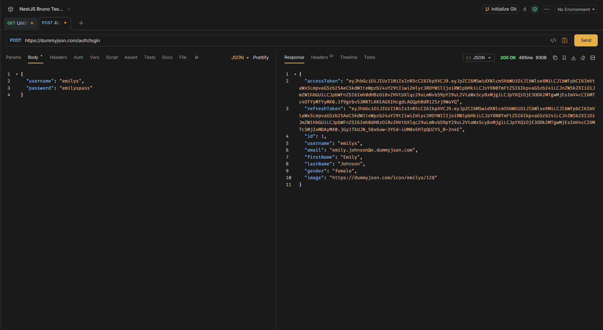

# Bruno

Bruno is an open-source API client used to send HTTP requests, inspect
responses, and test APIs. It is similar to Postman, but one of its main
differences is that Bruno is offline-first and Git-friendly. Bruno stores API
collections directly on your filesystem rather than requiring them to be stored
in a cloud workspace. Its collection can therefore be committed to Git alongside
your application code.

| Feature                              | Bruno        | Postman                                 | cURL            |
| ------------------------------------ | ------------ | --------------------------------------- | --------------- |
| GUI                                  | ✅           | ✅                                      | ❌              |
| Send HTTP requests                   | ✅           | ✅                                      | ✅              |
| Organise requests into collections   | ✅           | ✅                                      | ❌              |
| Git-friendly files                   | ✅           | Possible, but not its original workflow | N/A             |
| Offline-first                        | ✅           | More cloud-oriented                     | ✅              |
| Authentication                       | ✅           | ✅                                      | Manual          |
| Environment variables                | ✅           | ✅                                      | Manual          |
| Automated/CLI testing                | ✅ Bruno CLI | ✅ Postman CLI                          | Can be scripted |
| Easy to inspect requests visually    | ✅           | ✅                                      | ❌              |
| Account required for basic local use | ❌           | Commonly account/cloud features         | ❌              |

The important distinction for your reflection isn't that Bruno can do things
Postman fundamentally cannot. Both are API clients. Bruno's main difference is
how it stores and manages the work: collections and filesystem-based, making
them convenient to version-control with Git.

# Installation

`winget install Bruno.Bruno`

# Mannual adding of a public API request

For this purpose, I have gone ahead and created a new nestjs application.
Default one just for testing in bruno, I have done the same before in postman

```
GET
http://localhost:3000/
```

**Response** 

```
Hello World!
```

# Headers and authentication tokens

| **Name**       | **Value**                         |
| -------------- | --------------------------------- |
| x-powered-by   | Express                           |
| content-type   | text/html; charset=utf-8          |
| content-length | 12                                |
| etag           | W/"c-Lve95gjOVATpfV8EL5X4nxwjKHE" |
| date           | Thu, 17 Sep 2026 03:48:13 GMT     |
| connection     | keep-alive                        |
| keep-alive     | timeout=5                         |

Headers are metadata sent with an HTTP request. They're commonly used for things
such as:

- Content type
- Authentication
- API keys
- Accepted response formats
- Client information

But for this example, it is a default one, so we can see minimal and less
confidential data.

For a token-based API, you would commonly use:

`Authorization: Bearer YOUR_TOKEN`

In Bruno, this can be configured through the request's Auth settings or by
manually adding the header.

As for now, a dummyJSON is used just for demo.

`POST https://dummyjson.com/auth/login`

, used

```
{
  "username": "emilys",
  "password": "emilyspass"
}
```

for auth view, taking the access token from the login response into the auth of
the `GET https://dummyjson.com/auth/login`


Response

```
{
  "id": 1,
  "firstName": "Emily",
  "lastName": "Johnson",
  "maidenName": "Smith",
  "age": 29,
  "gender": "female",
  "email": "emily.johnson@x.dummyjson.com",
  "phone": "+81 965-431-3024",
  "username": "emilys",
  "password": "emilyspass",
  "birthDate": "1996-5-30",
  "image": "https://dummyjson.com/icon/emilys/128",
  "bloodGroup": "O-",
  "height": 193.24,
  "weight": 63.16,
  "eyeColor": "Green",
  "hair": {
    "color": "Brown",
    "type": "Curly"
  },
  "ip": "42.48.100.32",
  "address": {
    "address": "626 Main Street",
    "city": "Phoenix",
    "state": "Mississippi",
    "stateCode": "MS",
    "postalCode": "29112",
    "coordinates": {
      "lat": -77.16213,
      "lng": -92.084824
    },
    "country": "United States"
  },
  "macAddress": "47:fa:41:18:ec:eb",
  "university": "University of Wisconsin--Madison",
  "bank": {
    "cardExpire": "05/28",
    "cardNumber": "3693233511855044",
    "cardType": "Diners Club International",
    "currency": "GBP",
    "iban": "GB74MH2UZLR9TRPHYNU8F8"
  },
  "company": {
    "department": "Engineering",
    "name": "Dooley, Kozey and Cronin",
    "title": "Sales Manager",
    "address": {
      "address": "263 Tenth Street",
      "city": "San Francisco",
      "state": "Wisconsin",
      "stateCode": "WI",
      "postalCode": "37657",
      "coordinates": {
        "lat": 71.814525,
        "lng": -161.150263
      },
      "country": "United States"
    }
  },
  "ein": "977-175",
  "ssn": "900-590-289",
  "userAgent": "Mozilla/5.0 (Macintosh; Intel Mac OS X 10_15_7) AppleWebKit/537.36 (KHTML, like Gecko) Chrome/96.0.4664.93 Safari/537.36",
  "crypto": {
    "coin": "Bitcoin",
    "wallet": "0xb9fc2fe63b2a6c003f1c324c3bfa53259162181a",
    "network": "Ethereum (ERC20)"
  },
  "role": "admin"
}
```

# Reflection

## How does Bruno help with API testing compared to Postman or cURL?

Bruno provides a graphical interface for creating, sending, and inspecting API
requests, making it easier to test APIs than using cURL directly from the
command line. It provides features such as request collections, headers,
authentication, environment variables, and response inspection. Bruno is similar
to Postman in that both can be used to create and organise API requests, but
Bruno is designed to be offline-first and Git-friendly. Bruno stores collections
directly on the filesystem, allowing API requests to be version controlled and
committed to a Git repository alongside application code. This makes it useful
for keeping API testing resources organised with a software project.

## How do you send an authenticated request in Bruno?

An authenticated request can be sent by configuring the authentication settings
for the request or by adding an Authorization header. For a bearer-token
authentication system, the header can be configured as
`Authorization: Bearer <token>`. The server then uses the token to determine
whether the request is authorised. Bruno can also use variables and environments
so that sensitive values such as tokens do not need to be written directly into
every request.

## What are the advantages of organizing API requests in collections?

Collections allow related API requests to be stored and organised together. For
example, requests for users, authentication, or habits can be separated into
folders within a collection. This makes requests easier to find and reuse when
testing multiple endpoints. Collections also provide a consistent place to store
API requests, headers, authentication settings, and test configurations. In
Bruno, collections are stored on the filesystem, which also makes them suitable
for Git version control and collaboration with other developers.
