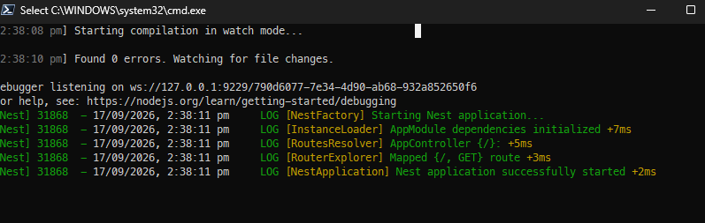
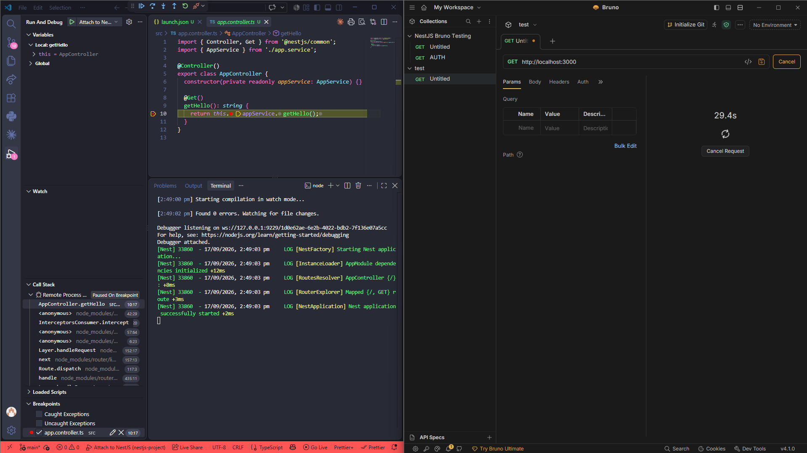
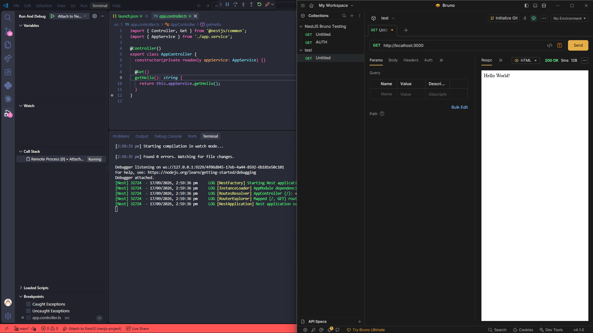

# Configuring VS Code debugger

VS Code ships with the 'JavaScript Debug Terminal' and Node debugger by default,
so no extension install is usually needed

In package.json, NestJS's Nest CLI already supports a debug flag:
`"start:debug": "nest start --debug --watch"`. This runs Node with `--inspect`
under the hood, which opens a debug port (default 9229) that VS Code can attach
to.

- Create .vscode/launch.json (for request type launch)

  ```
  {
  "version": "0.2.0",
  "configurations": [
        {
            "type": "node",
            "request": "launch",
            "name": "Debug NestJS",
            "runtimeExecutable": "npm",
            "runtimeArgs": ["run", "start:debug"],
            "console": "integratedTerminal",
            "restart": true,
            "autoAttachChildProcesses": true,
            "skipFiles": ["<node_internals>/**"]
        }
    ]
  }
  ```

For (attach config)

```
{
  "version": "0.2.0",
  "configurations": [
    {
      "type": "node",
      "request": "attach",
      "name": "Attach to NestJS",
      "port": 9229,
      "restart": true,
      "skipFiles": ["<node_internals>/**"]
    }
  ]
}
```

I will be using the attach config for this

**Attaching from VSCODE**

Open the Run and Debug panel, pick "Attach to NestJS" from the dropdown, and
press F5 (or the play button). VS Code connects to port 9229 — no new process is
spawned, it just hooks into the one already running.

If there is any missing options, use `ctrl+shift+D` and see an attach to NestJS
option, and run that instance

after config: `npm run start:debug`,

This runs nest start --debug --watch, which under the hood passes --inspect to
Node. You should see output like:



After that you can continue with having breakpoints:

For example: 

As can be seen, the request is not going through because the breakpoint is
stopping at the point and its running endlessly in bruno.

The Variables panel shows the live state of everything in scope at that paused
line — a frozen snapshot of memory, not a fixed list.

- this — the class instance (e.g. AppController), including injected
  dependencies like this.appService. Useful for confirming DI actually wired
  things up correctly.
- Local variables — params (query, body, route params) and any variables
  declared so far in the method. Only populated once that line has actually run.
- Closure/outer scope — variables from an enclosing function, if relevant.

The key difference from console.log: it updates live as you step (F10/F11), so
you're watching state change in real time instead of guessing what to print
beforehand.

After breakpoint is solved, you see it can be run.


# Reflection

## How do breakpoints help in debugging compared to console logs?

Console logs only show you the values you thought to print, at the moment you
decided to print them, and you have to re-run the app after every change. A
breakpoint pauses live execution, lets you inspect every variable in scope (not
just ones you logged), step forward one line at a time, and even change values
on the fly via the Debug Console; no restart, no editing code to add temporary
print statements

## What is the purpose of launch.json, and how does it configure debugging?

It tells VS Code's debugger how to start (or attach to) your process: which
runtime to use, what command/script to run, which port to connect to, and how
source maps or TypeScript compilation should be handled so breakpoints in .ts
files map correctly to the running .js. Without it, VS Code has no idea how your
app boots or where to find the debug port.

## How can you inspect request parameters and responses while debugging?

Pause on a breakpoint inside the controller: the Variables panel shows the
Request object (or whatever param you destructured, e.g. @Body() dto), and you
can expand it to see headers, body, query params. To see the response, set a
breakpoint just before the return statement (or in an interceptor) and inspect
the object about to be sent back — or use the Debug Console to evaluate
expressions against variables currently in scope

## How can you debug background jobs that don’t run in a typical request-response cycle?

For things like cron jobs (@Cron()), queue consumers (Bull/BullMQ), or event
listeners, you can't trigger them with an HTTP request, so instead: set the
breakpoint inside the job handler method itself and either (a) trigger the job
manually — call the queue's add() method or invoke the cron method directly from
a test/console — or (b) just let the scheduler fire naturally and wait, since
the debugger stays attached as long as the process is running in debug mode. The
key difference is you're waiting for an internal trigger (timer, message, event)
rather than sending a request yourself, but the pause-and-inspect mechanics are
identical once the breakpoint hits.
