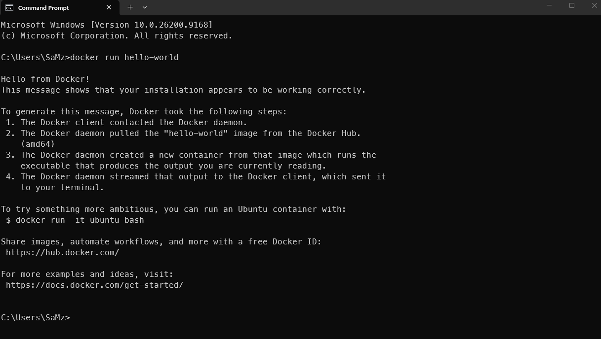

# Docker setup

Proof: 

## Docker commands

- docker ps: Lists only the currently running containers.
- docker ps -a: Lists all containers, including those that are stopped or
  crashed.
- docker logs <container>: Displays the console output and errors generated by a
  specific container.
- docker logs -f <container>: Streams live, real-time log updates as they
  happen.
- docker stats: Displays a live stream of CPU, memory, and network usage per
  container.
- docker inspect <container>: Returns low-level configuration details in JSON
  format (e.g., IP addresses, mounts).
- docker stop <container>: Gracefully shuts down a container by sending a
  SIGTERM signal.
- docker start <container>: Restarts a container that was previously stopped
  without losing its internal changes.
- docker kill <container>: Forcefully shuts down a container immediately via
  SIGKILL.
- docker rm <container>: Permanently deletes a stopped container from your
  system.
- docker system prune: A powerful cleanup command that deletes all stopped
  containers, unused networks, and dangling images at once.

## 1. Docker run and Docker compose

**`docker run`** is used to create and start a single container directly from
the command line, whereas **`docker compose`** is a tool used to define and
manage an application and its services using a YAML configuration file. While
`docker run` requires you to specify options such as environment variables,
ports, and volume mappings through command-line arguments, Docker Compose allows
these settings to be stored in a reusable `compose.yaml` file. This makes the
configuration easier to maintain and allows the same application environment to
be started consistently across different machines.

For example, with `docker run`, you might need to specify the configuration
every time:

```bash
docker run -d -p 3000:3000 -e NODE_ENV=production my-app
```

With Docker Compose, the same configuration can be stored in a YAML file:

```yaml
services:
  app:
    image: my-app
    ports:
      - "3000:3000"
    environment:
      NODE_ENV: production
```

The application can then be started with:

```bash
docker compose up
```

This becomes particularly useful when an application has multiple services, such
as a frontend, backend, and database. Instead of manually starting and
configuring each container, Docker Compose can define all of these services in
one file and start them together.

### Direct Comparison

| **Feature**              | **`docker run`**                                                 | **`docker compose`**                                      |
| ------------------------ | ---------------------------------------------------------------- | --------------------------------------------------------- |
| **Primary Use Case**     | Running an individual container, quick testing, or one-off tasks | Managing an application with one or more related services |
| **Configuration**        | Command-line arguments and flags                                 | Declarative YAML file such as `compose.yaml`              |
| **Container Count**      | Creates and starts one container per command                     | Can create and manage multiple containers/services        |
| **Service Dependencies** | Dependencies need to be configured and managed manually          | Can define service dependencies using `depends_on`        |
| **Networking**           | Uses the default network unless another network is specified     | Creates a dedicated application network by default        |
| **Repeatability**        | Commands need to be saved or repeated manually                   | Configuration can be stored in Git and reused             |
| **Management**           | Individual containers are managed separately                     | Services can be started, stopped, and managed together    |

The main advantage of Docker Compose is therefore **reproducibility and easier
management**. Instead of remembering a long list of Docker commands and options,
developers can store the application's infrastructure configuration in a YAML
file. Another developer can then use the same file to recreate the same
development environment.

## 2. How does Docker Compose help when working with multiple services?

Most real applications are made up of more than one service. For example, a web
application might have:

```text
Frontend → Backend → Database
```

The frontend could be a React application, the backend could be a Node.js
application, and the database could be PostgreSQL.

Without Docker Compose, each container would need to be started and configured
separately using multiple `docker run` commands. This can become difficult
because each service may require its own ports, environment variables, volumes,
networks, and other configuration.

Docker Compose allows all of these services to be defined in a single
configuration file, and all the services can be started together.

Compose also creates a network for the services, allowing them to communicate
with each other. For example, the backend can connect to the database using the
service name `database` rather than needing to know the database container's IP
address.

Docker Compose therefore makes multi-service applications easier to configure,
start, stop, and reproduce. A developer can clone a project and, assuming the
required images/build configuration are available, use a single command to start
the application's environment.

---

## 3. What commands can you use to check logs from a running container?

Docker containers often run applications that produce output such as errors,
requests, warnings, or status messages. Docker provides the `docker logs`
command to view this output.

To view the logs from a container:

```bash
docker logs <container_name>
```

For example:

```bash
docker logs my-app
```

This displays the logs that have already been produced by the container.

If you want to monitor the logs while the application is running, you can use
the `-f` option:

```bash
docker logs -f my-app
```

The `-f` means "follow". Docker will continue displaying new log messages as
they are produced. This is particularly useful when debugging an application
because you can perform an action in the application and immediately see the
resulting log output.

You can also limit the amount of output using `--tail`:

```bash
docker logs --tail 100 my-app
```

This displays only the last 100 lines.

When using Docker Compose, logs can be viewed for all services with:

```bash
docker compose logs
```

You can also check the logs for one particular service:

```bash
docker compose logs backend
```

And continuously follow its logs:

```bash
docker compose logs -f backend
```

These commands are useful for troubleshooting problems such as application
crashes, connection errors, incorrect environment variables, or failed database
connections.

---

## 4. What happens when you restart a container? Does data persist?

When a container is restarted using:

```bash
docker restart <container_name>
```

Docker stops the running container and then starts the same container again.

The container itself is not deleted. Therefore, files stored in the container's
writable filesystem normally remain after a simple restart.

For example, if an application creates:

```text
/app/data/example.txt
```

and the container is restarted, `example.txt` will normally still be there.

If the container is removed:

```bash
docker rm <container_name>
```

the writable filesystem belonging to that container is removed as well. Any
important data that was stored only inside the container can therefore be lost.

For persistent data, Docker provides **volumes**.