# Company reflection

## Why do you think Focus Bear was created?

Our Founder and CEO, Jeremy Nagel was late-diagnosed with ADHD. He had tried
every app, every system. So he built the thing he actually needed, something
that starts the morning and then blocks the rabbit holes before you can fall in,
and forgives me when I slip. Focus Bear is a tool that is built by ADHD brains.
It reduces decisions, removes the willpower tax, and guides you one step at a
time instead of handing you a blank to-do list.

## What problem is Focus Bear solving?

Focus Bear is solving the difficulty people with ADHD can have with maintaining
focus, managing distractions, and sticking to routines. It provides tools that
help users reduce digital distractions, establish structured routines, and stay
focused on tasks without relying entirely on willpower or motivation.

## Why do you think this mission is important?

As someone who has been observing himself for doubts regarding having ADHD, the
mission is very personal to me. ADHD is more of 'executive dysfunction' than
hyperactivity or lack of focus. Being torn between doing many tasks, or events
that are going to happen further in a day gives us choice paralysis. In turn, we
become unable to do anything because of the lack of proper time evaluation. So
the fact that we are trying to combat this with giving set focus times with
blockage and some sort of routine, which are more harder to skip, makes it
easier to work on. This is something I have experienced myself.

## How does Focus Bear's work align with your personal values or interests?

As mentioned above, as someone with self-diagnosis of ADHD, it took me years of
self doubt and worthlessness to finally stumbling upon this condition. If I had
known earlier, it would have not affected my studies, as I was doing well. But
it would have done wonders for my mental health. From my experience with the app
and my own pattern, I require flexibility to work, listening to music. I have
also seen my cousin with ADHD require a restrictive system. So the fact that we
are assisting people with work and giving them autonomy to block distracting
app, while also giving them flexibility by the timer and the indication of task
alignment, it is something very personally related. It works with my values and
interest regarding my brain.

## Personal connection

When it comes to the challenges of a neurodivergent mind, I am well experienced
in that area. From the constant breakdown of not being able to reply to
messages, not being able to start a task a few weeks before the due date, and
letting the pressure and chaos of the deadline making me rush to start and
finish the tasks. So, I can personally relate to any of the challenges that
Focus Bear aims to solve.

## Specific Life example

As I have said, with ADHD, the hard part is getting started, and well, taking a
break afterwards as well. When there was no clear distinction I would just shut
down.

What I mean by this is that I have studied for like 2-3 hours and brain is
overwhelmed and need rest. But that guilt of not studying makes it harder to
rest, and if rest begins, the study might not be resumed after the break.

So the indication of time to work and time to rest will make it such that I
would not be overwhelmed and also be able to work/rest. This is what the desired
circumstances should be.

# First Time user Experience

Doing it in Windows in a portable laptop (ASUS tuf a15)

- Asks for sign up using google, apple or using email

- Asks for setting up distraction blocking
  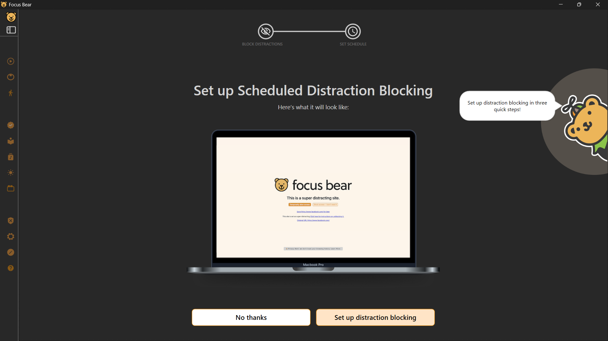

- Step one: 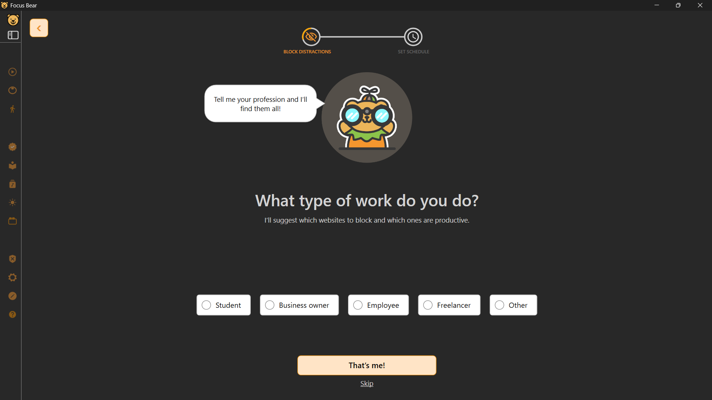

- Gives option to use AI to block distractions?: We are made aware that the AI
  will never record our information, the browsing is private and the feature is
  optional.

- Allow website blocking: chose what to block and what not to block, for example
  youtube music or spotify. 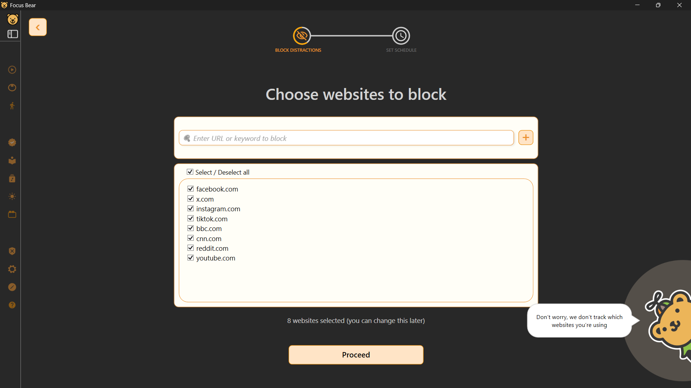
  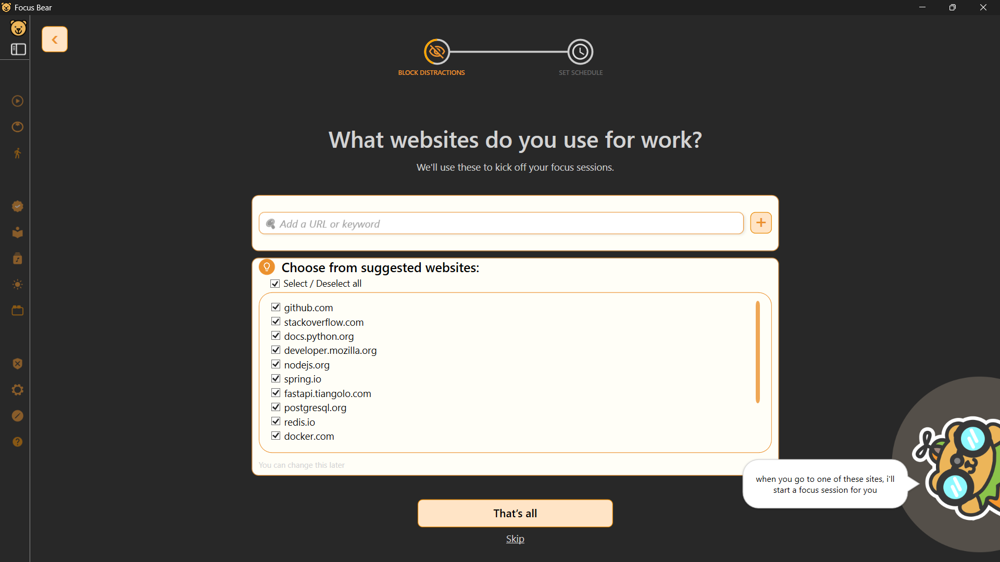

- Allow scheduling of blocking (for example, for blocking while at work hours)
  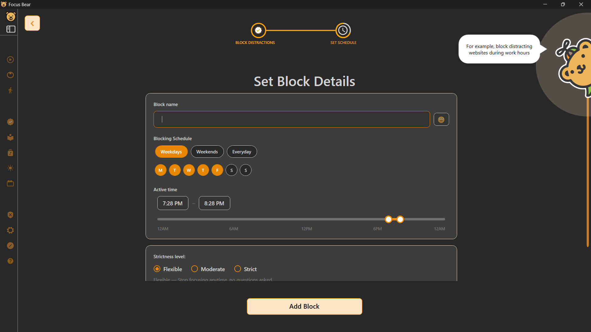

- Ability to choose strictness level according to your preference.

- Allows setting up habits.

## Pain Points/Confusing part:

### Brain Dump:

For brain dump, I can write in te but there is no option to save it for later.
We do have an option to manually add notes that we already know that we want.
But the ones we have not planned to save, and was filled during focus hour when
the mind was wondering. The only way to save it is to copy the text to another
place.

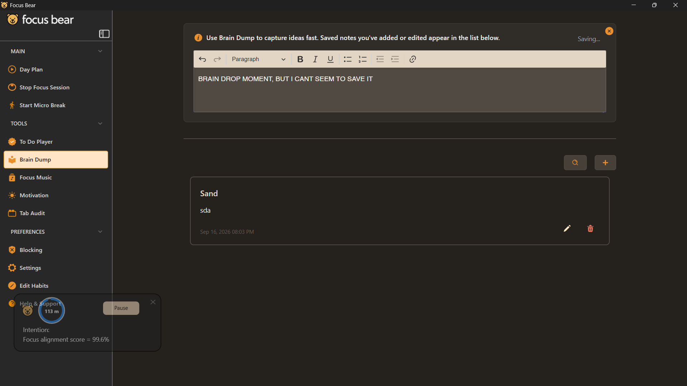

It is saved while working, but not in a different note, like the one seen in the
image.

### The TOP Score

The calculation of the TOP score is the problem that I am facing. In here, I can
add a perspiration, and it doesnot actually describe what it means.

Also the score is supposed to mean that the higher priority it is the more it
has a score, but its still confusing, does it think that if Perspiration is 2
weeks, and due date is tomorrow, that means that I have worked on it 2 weeks??.
SO this part is confusing for me.

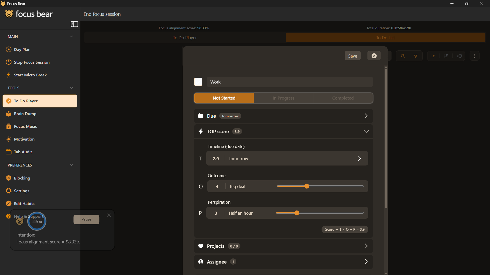

### Micro Breaks

For micro breaks, we need to add habits before we can actually use the feature,
even when we enabled it. Sometimes we need just do nothing or free form, which I
would think would be default when there was no micro break activities set up.

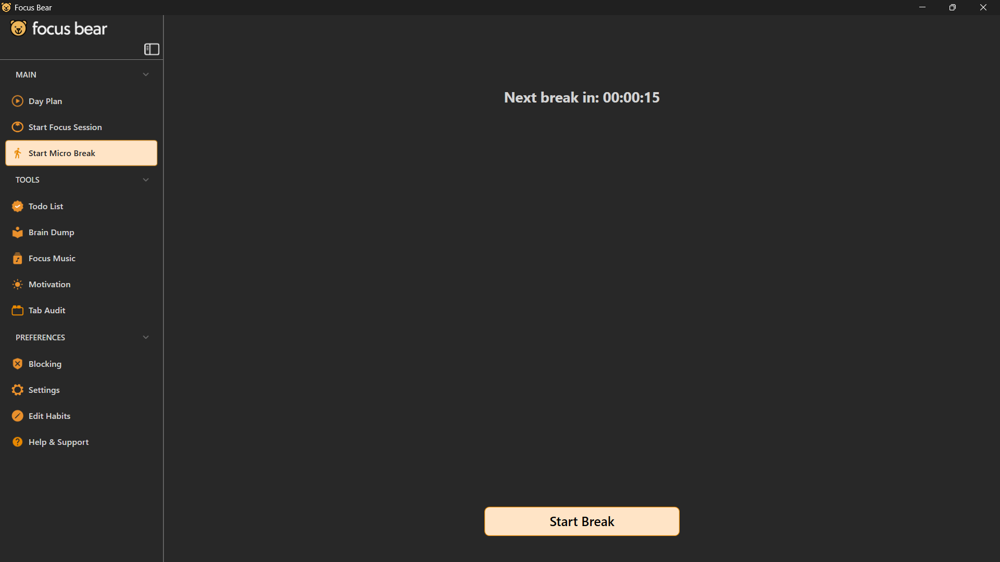

### Focus Music

For some people, including me, require music with lyrics, and include classicals
and ones, to actually work well. If there was an option to link spotify or
youtube music and have strict observation of what the music should be like, I
think that is more helpful.

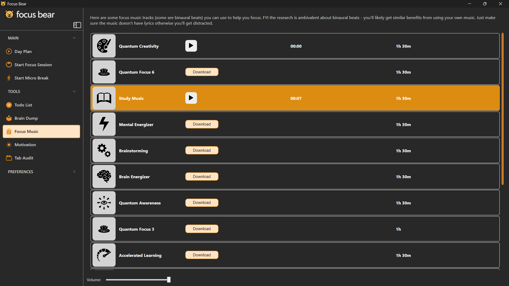

### The Motivation Page

In the motivation page, in your goals, I haven't found anyway to add the long
terms goals, there are no option in this window, And there should be option to
add it in the window if nothing has been set yet.

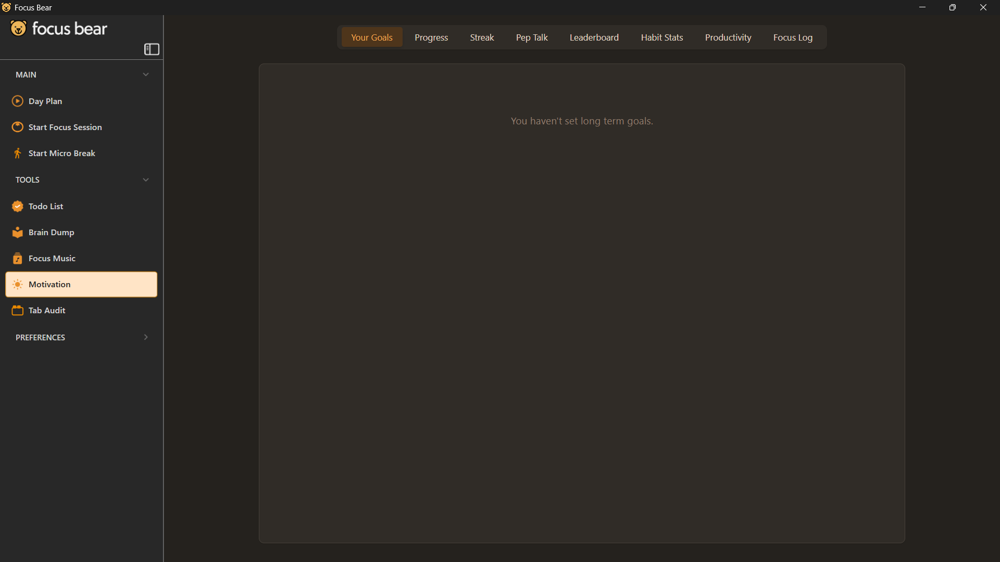

## Improvement in onboarding.

In terms of onboarding, I think that it is pretty good, just more information
about actually putting the proof of the tasks that have been done. More
clarification on where we should include screenshots, so the bot does not flag
it. And for the "Clean Code" milestone, making issues #67 and #73 in a different
file, not in the same clean_code.md. This makes it harder to actually review it,
especially when the bot can only read until a limit of characters/lines.

## Logged bug

I loggeed an issue in the focus logs and have submitted the bug report.
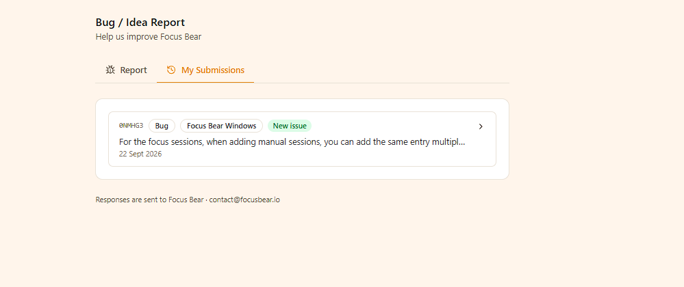

# Get to know the Focus Bear product reflecting my roles (backend devloper intern)

## 3 things I learned

- The app doesn't just run a timer - it decides what counts as "tasks". When in
  focus session, Focus Bear looks at every site that are opened and descides
  whether it aligns with your current objective or not, displaying a alignment
  score. This is done using AI plus the block/allow lists that has been set up,
  which prompts us if we try to access the blocked website.

- Morning and evening routines are not optional. You can not skip past the set
  up habit routine naturally and get on with your day. The apps blocks the rest
  of your computer until its been gone through, or you decide to skip with the
  skip button. That means somewhere behind the scenes, the app has to track
  exactly which habits are required, which are skippable, and whether you've
  actually gone through each one, which is more complex than it looks from the
  outside.

- The app remembers your patterns over time. At the end of the day, you get a
  report showing your focus sessions, the breaks taken and the habits
  participation. means the app is quietly logging everything you do throughout
  the day so it can be summarized later, a diary that writes itself.

- It has to work the same way, no matter which device you're on. Whether you're
  on your phone or your laptop, the settings, streaks and block lists all need
  to match up. That sounds simple, but it means the system has to carefully keep
  everything in sync across devices, and handle it gracefully if you change
  something on one device while offline on another.

# Reflection

## What did I learn that I didn't know before?

I found out many of the qualities of the application which make it more
supportive than restrictive are hidden under the covers and not visible in the
user interface. It is not only the nice UI elements like checking for the
distracting website, but also the decisions made by the application constantly.
This included detecting the approaching deadline for an event, which determine
its overall usefulness or uselessness.

## Did I spot anything in the help centre that seems out of date or inconsistent?

From my observation, the key features and tutorials remain consistent. The
articles are made using images from mac, which might have some changes but in
windows, I see no changes.
