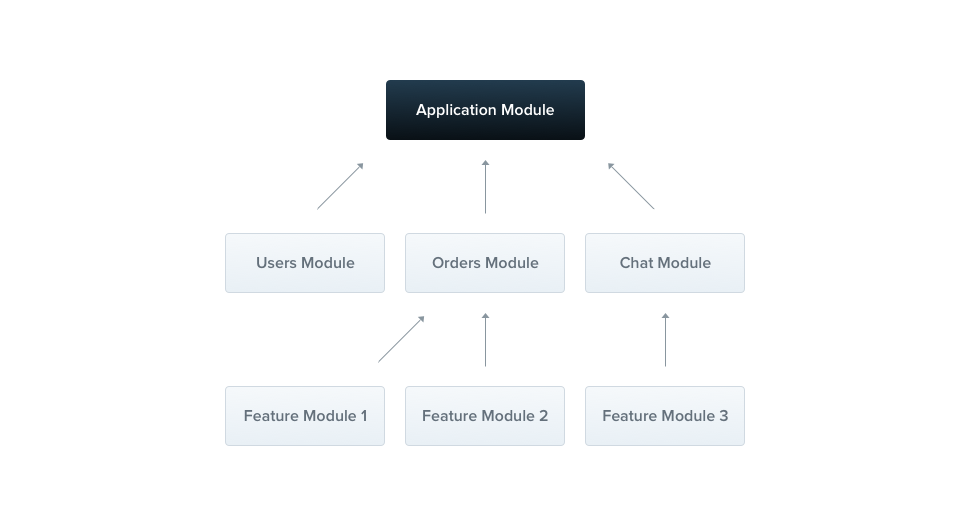
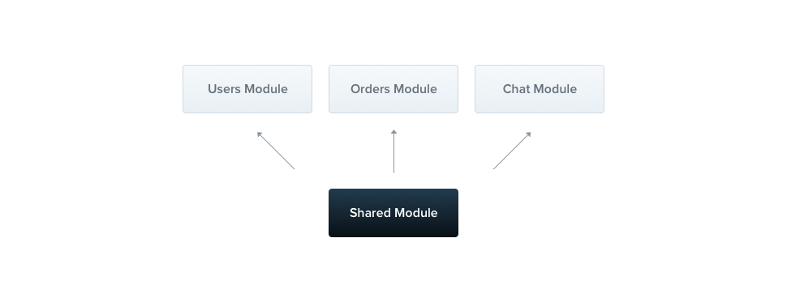

# Nest JS

## Difference between Nest js and express js

| Feature                  | Express.js                                    | NestJS                                                   |
| ------------------------ | --------------------------------------------- | -------------------------------------------------------- |
| **Type**                 | Minimal web framework                         | Full-featured backend framework                          |
| **Architecture**         | Flexible; you choose how to structure the app | Opinionated, structured architecture                     |
| **Language**             | JavaScript / TypeScript                       | Primarily TypeScript                                     |
| **Underlying framework** | Standalone                                    | Built on Express by default (can also use Fastify)       |
| **Dependency Injection** | Not built-in                                  | Built-in                                                 |
| **Modules**              | No built-in module system                     | Built-in modules for organising features                 |
| **Controllers**          | Must be implemented manually                  | Built-in controller system                               |
| **Middleware**           | Built-in                                      | Supports middleware plus guards, pipes, and interceptors |
| **Validation**           | Requires additional libraries/setup           | Built-in support through pipes and validation libraries  |
| **Scalability**          | Good, but structure is up to the developer    | Designed for large, maintainable applications            |
| **Learning curve**       | Easier to learn                               | Steeper due to more concepts                             |
|                          |                                               |                                                          |

## NestJS mudularity



Every Nest applicatioin has at least one module, the **root module**, which
serves as the starting point for Nest to build the application graph.

**Feature modules** organizes code that is relevant to a specific feature,
helping to maintain clear boundaries and better organization.

 **Shared Modules**: Modules are singletons
by default, and thus you can share the same instance of any provider between
multiple modules effortlessly. Every module is automatically a shared module.
Once created it can be reused by any module.

### Benefits

- Faster builds: Compiles tiny segments instead of the entire monolithic
  codebase.
- Parallel work: Independent engineering teams build features without merge
  conflicts.
- Isolated testing: Focuses automated tests only on modified application
  components.
- Easy maintenance: Fixes bugs within a single module safely.
- Code reuse: Shares finished components easily across separate app features.
- Faster onboarding: Enables new hires to learn small parts quickly.

## Dependency injection

Dependency injection is an inversion of control (IoC) technique wherein you
delegate instantiation of dependencies to the IoC container (in our case, the
NestJS runtime system), instead of doing it in your own code imperatively.

With NestJS, you declare dependencies in the constructor, and the framework
automatically resolves and injects them using runtime metadata.

```typescript
@Injectable()
export class UsersService {}

@Controller("users")
export class UsersController {
  constructor(private readonly usersService: UsersService) {}
}
```

It is crusial in NestJS because:

- It simplifies unit testing, classes can be easily isolated by passing mock
  objects into constructors instead of instantiating real services or
  connections
- Providers are treated as singletons by default, meaning a single shared
  instance is cached and reused across the application to save memory.
- Enforced Modular Architecture: By explicitly registering providers in module
  arrays, the framework promotes a clean separation of concerns.
- Flexible Implementation Swapping: Using tokens and custom providers allows you
  to swap out underlying implementations (like switching environment-based
  services) without altering consumer code.

### Under the hood

1. Declaration (@Injectable): Marks a class as manageable by the IoC container.
2. Registration (@Module): Lists the class in a module's providers array.
3. Resolution (Constructor Injection): Scans constructor parameters and
   dynamically injects the required instances

## Use of Decorators

An ES2016 decorator is an expression which returns a function and can take a
target, name and property descriptor as arguments. You apply it by prefixing the
decorator with an **@** character and placing this at the very top of what you
are trying to decorate. Decorators can be defined for either a class, a method
or a property.

There are a list of provided decoraters by NestJS. Additionally, you can create
your own custom decorators.

So, in node.js world, it is a common practice to attach properties to the
request object. Then you manually extract them in each route handler, using code
like the following:

```node
const user = req.user;
```

In order to make the code more readable and transparednt, you can create @User()
decorator and reuse it across all of your controllers.

```JS

import { createParamDecorator, ExecutionContext } from '@nestjs/common';

export const User = createParamDecorator(
  (data: unknown, ctx: ExecutionContext) => {
    const request = ctx.switchToHttp().getRequest();
    return request.user;
  },
);

```

Then, you can simply use it whenever it fits your requirement

```JS

@Get()
async findOne(@User() user: UserEntity) {
  console.log(user);
}

```
