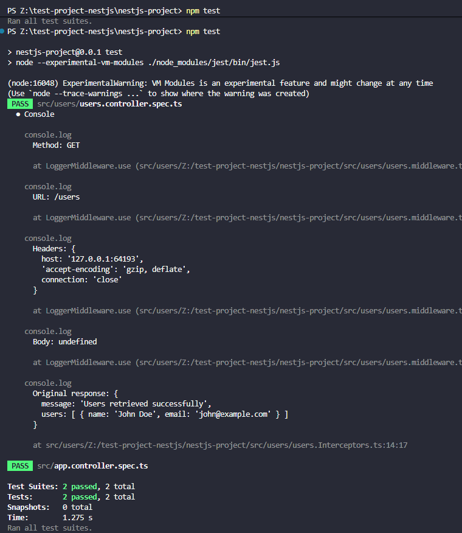
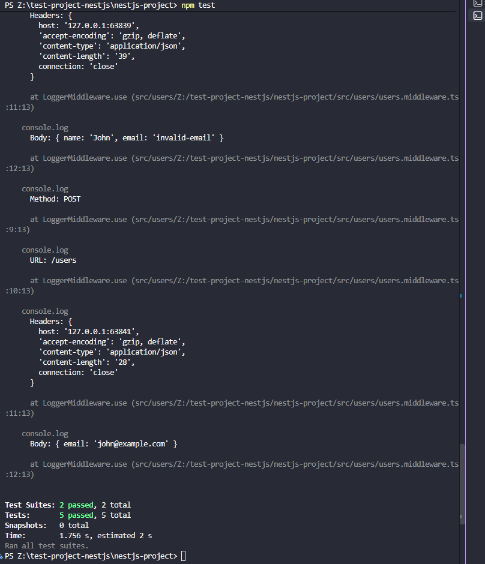
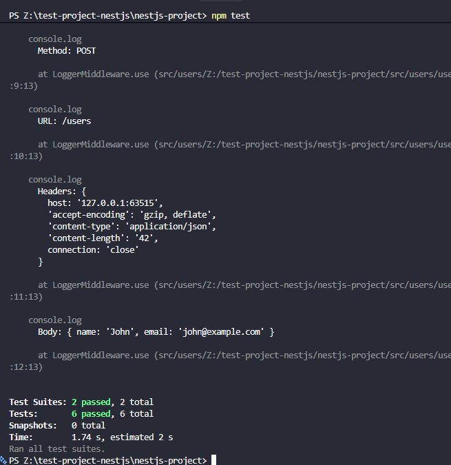

# End to end testing

## Supertest in NestJS

Supertest is a library used to test HTTP APIs by sending requests to an
application and checking the responses. In NestJS, it is commonly used with Jest
and @nestjs/testing to create an application instance and make requests against
it.

Installation: `npm install --save-dev supertest @types/supertest`

## Testing the Get API endpoint

```ts
//users.controller.ts

import { Controller, Get, Req, UseInterceptors } from "@nestjs/common";
import type { Request } from "express";
import { ResponseLoggerInterceptor } from "./users.Interceptors";
import { UsersService } from "./users.service";

@Controller("users")
@UseInterceptors(ResponseLoggerInterceptor)
export class UsersController {
  constructor(private readonly usersService: UsersService) {}

  @Get()
  getUsers() {
    return {
      message: "Users retrieved successfully",
      users: [{ name: "John Doe", email: "john@example.com" }],
    };
  }
}
```

```ts
//users.controller.specs.ts

import { INestApplication } from "@nestjs/common";
import { Test, TestingModule } from "@nestjs/testing";
import request from "supertest";

import { AppModule } from "../app.module";

describe("Users API", () => {
  let app: INestApplication;

  beforeAll(async () => {
    const moduleFixture: TestingModule = await Test.createTestingModule({
      imports: [AppModule],
    }).compile();

    app = moduleFixture.createNestApplication();

    await app.init();
  });

  afterAll(async () => {
    await app.close();
  });

  describe("GET /users", () => {
    it("should return users", async () => {
      const response = await request(app.getHttpServer())
        .get("/users")
        .expect(200);

      expect(response.body).toEqual({
        intercepted: true,
        message: "Users retrieved successfully",
        users: [
          {
            name: "John Doe",
            email: "john@example.com",
          },
        ],
      });
    });
  });
});
```

Result:

```
PS Z:\test-project-nestjs\nestjs-project> npm test

> nestjs-project@0.0.1 test
> node --experimental-vm-modules ./node_modules/jest/bin/jest.js

(node:16048) ExperimentalWarning: VM Modules is an experimental feature and might change at any time
(Use `node --trace-warnings ...` to show where the warning was created)
 PASS  src/users/users.controller.spec.ts
  ● Console

    console.log
      Method: GET

      at LoggerMiddleware.use (src/users/Z:/test-project-nestjs/nestjs-project/src/users/users.middleware.ts:9:13)

    console.log
      URL: /users

      at LoggerMiddleware.use (src/users/Z:/test-project-nestjs/nestjs-project/src/users/users.middleware.ts:10:13)

    console.log
      Headers: {
        host: '127.0.0.1:64193',
        'accept-encoding': 'gzip, deflate',
        connection: 'close'
      }

      at LoggerMiddleware.use (src/users/Z:/test-project-nestjs/nestjs-project/src/users/users.middleware.ts:11:13)

    console.log
      Body: undefined

      at LoggerMiddleware.use (src/users/Z:/test-project-nestjs/nestjs-project/src/users/users.middleware.ts:12:13)

    console.log
      Original response: {
        message: 'Users retrieved successfully',
        users: [ { name: 'John Doe', email: 'john@example.com' } ]
      }

      at src/users/Z:/test-project-nestjs/nestjs-project/src/users/users.Interceptors.ts:14:17

 PASS  src/app.controller.spec.ts

Test Suites: 2 passed, 2 total
Tests:       2 passed, 2 total
Snapshots:   0 total
Time:        1.275 s
Ran all test suites.
```



## Testing the POST API endpoint with request validation

I wrote an integration test for the `POST /users` API endpoint using Supertest
and NestJS's `ValidationPipe`. A `CreateUserDto` was used to define the required
user fields and validate that the name is not empty and the email has a valid
email format. The test sends valid user data and verifies that the API returns a
`201 Created` response with the expected user data. I also added failure cases
where the email is invalid or the name is missing, which should return a
`400 Bad Request` response. This allows the integration test to verify both
successful requests and the API's handling of invalid input.

Created a DTO validation for this testing

```ts
create - user.dto.ts;

import { IsEmail, IsNotEmpty, IsString } from "class-validator";

export class CreateUserDto {
  @IsString()
  @IsNotEmpty()
  name: string;

  @IsEmail()
  email: string;
}
```

Updating the Controller:

```ts
//users.controller.ts

import { Body, Controller, Post, Get, UseInterceptors } from "@nestjs/common";

import { ResponseLoggerInterceptor } from "./users.Interceptors";
import { UsersService } from "./users.service";
import { CreateUserDto } from "./dto/create-user.dto";

@Controller("users")
@UseInterceptors(ResponseLoggerInterceptor)
export class UsersController {
  constructor(private readonly usersService: UsersService) {}

  @Get()
  getUsers() {
    return {
      message: "Users retrieved successfully",
      users: [
        {
          name: "John Doe",
          email: "john@example.com",
        },
      ],
    };
  }

  @Post()
  createUser(@Body() userData: CreateUserDto) {
    return this.usersService.createUser(userData);
  }
}
```

Enabling validation in `users.controller.spec.ts` by adding

```ts
Import {ValidationPipe} from '@nestjs/common';

app.useGlobalPipes(new ValidationPipe({
    whitelist: true,
  }));
```

adding integration tests in `users.controller.spec.ts`:

```ts
describe("POST /users", () => {
  it("should create a user with valid data", async () => {
    const response = await request(app.getHttpServer())
      .post("/users")
      .send({
        name: "John",
        email: "john@example.com",
      })
      .expect(201);

    expect(response.body).toEqual({
      intercepted: true,
      message: "User received",
      data: {
        name: "John",
        email: "john@example.com",
      },
    });
  });

  it("should reject a user with an invalid email", async () => {
    await request(app.getHttpServer())
      .post("/users")
      .send({
        name: "John",
        email: "invalid-email",
      })
      .expect(400);
  });

  it("should reject a user with a missing name", async () => {
    await request(app.getHttpServer())
      .post("/users")
      .send({
        email: "john@example.com",
      })
      .expect(400);
  });
});
```

**Result:**

```
PS Z:\test-project-nestjs\nestjs-project> npm test

> nestjs-project@0.0.1 test
> node --experimental-vm-modules ./node_modules/jest/bin/jest.js

(node:12608) ExperimentalWarning: VM Modules is an experimental feature and might change at any time
(Use `node --trace-warnings ...` to show where the warning was created)
 PASS  src/app.controller.spec.ts
(node:33964) ExperimentalWarning: VM Modules is an experimental feature and might change at any time
(Use `node --trace-warnings ...` to show where the warning was created)
 PASS  src/users/users.controller.spec.ts
  ● Console

    console.log
      Method: GET

      at LoggerMiddleware.use (src/users/Z:/test-project-nestjs/nestjs-project/src/users/users.middleware.ts:9:13)

    console.log
      URL: /users

      at LoggerMiddleware.use (src/users/Z:/test-project-nestjs/nestjs-project/src/users/users.middleware.ts:10:13)

    console.log
      Headers: {
        host: '127.0.0.1:63835',
        'accept-encoding': 'gzip, deflate',
        connection: 'close'
      }

      at LoggerMiddleware.use (src/users/Z:/test-project-nestjs/nestjs-project/src/users/users.middleware.ts:11:13)

    console.log
      Body: undefined

      at LoggerMiddleware.use (src/users/Z:/test-project-nestjs/nestjs-project/src/users/users.middleware.ts:12:13)

    console.log
      Original response: {
        message: 'Users retrieved successfully',
        users: [ { name: 'John Doe', email: 'john@example.com' } ]
      }

      at src/users/Z:/test-project-nestjs/nestjs-project/src/users/users.Interceptors.ts:14:17

    console.log
      Method: POST

      at LoggerMiddleware.use (src/users/Z:/test-project-nestjs/nestjs-project/src/users/users.middleware.ts:9:13)

    console.log
      URL: /users

      at LoggerMiddleware.use (src/users/Z:/test-project-nestjs/nestjs-project/src/users/users.middleware.ts:10:13)

    console.log
      Headers: {
        host: '127.0.0.1:63837',
        'accept-encoding': 'gzip, deflate',
        'content-type': 'application/json',
        'content-length': '42',
        connection: 'close'
      }

      at LoggerMiddleware.use (src/users/Z:/test-project-nestjs/nestjs-project/src/users/users.middleware.ts:11:13)

    console.log
      Body: { name: 'John', email: 'john@example.com' }

      at LoggerMiddleware.use (src/users/Z:/test-project-nestjs/nestjs-project/src/users/users.middleware.ts:12:13)

    console.log
      Original response: {
        message: 'User received',
        data: { name: 'John', email: 'john@example.com' }
      }

      at src/users/Z:/test-project-nestjs/nestjs-project/src/users/users.Interceptors.ts:14:17

    console.log
      Method: POST

      at LoggerMiddleware.use (src/users/Z:/test-project-nestjs/nestjs-project/src/users/users.middleware.ts:9:13)

    console.log
      URL: /users

      at LoggerMiddleware.use (src/users/Z:/test-project-nestjs/nestjs-project/src/users/users.middleware.ts:10:13)

    console.log
      Headers: {
        host: '127.0.0.1:63839',
        'accept-encoding': 'gzip, deflate',
        'content-type': 'application/json',
        'content-length': '39',
        connection: 'close'
      }

      at LoggerMiddleware.use (src/users/Z:/test-project-nestjs/nestjs-project/src/users/users.middleware.ts:11:13)

    console.log
      Body: { name: 'John', email: 'invalid-email' }

      at LoggerMiddleware.use (src/users/Z:/test-project-nestjs/nestjs-project/src/users/users.middleware.ts:12:13)

    console.log
      Method: POST

      at LoggerMiddleware.use (src/users/Z:/test-project-nestjs/nestjs-project/src/users/users.middleware.ts:9:13)

    console.log
      URL: /users

      at LoggerMiddleware.use (src/users/Z:/test-project-nestjs/nestjs-project/src/users/users.middleware.ts:10:13)

    console.log
      Headers: {
        host: '127.0.0.1:63841',
        'accept-encoding': 'gzip, deflate',
        'content-type': 'application/json',
        'content-length': '28',
        connection: 'close'
      }

      at LoggerMiddleware.use (src/users/Z:/test-project-nestjs/nestjs-project/src/users/users.middleware.ts:11:13)

    console.log
      Body: { email: 'john@example.com' }

      at LoggerMiddleware.use (src/users/Z:/test-project-nestjs/nestjs-project/src/users/users.middleware.ts:12:13)


Test Suites: 2 passed, 2 total
Tests:       5 passed, 5 total
Snapshots:   0 total
Time:        1.756 s, estimated 2 s
Ran all test suites.
PS Z:\test-project-nestjs\nestjs-project>
```



## Mock authentication in API tests

In this task, I will be mocking the authentication by making the test request
include a fake JWT instead of implementing a real login flow.

**Installation of JWT** `npm install @nestjs/jwt`

Creating a simple JWT guard for mocking authentication

```ts
//test-auth.guard.ts

import {
  CanActivate,
  ExecutionContext,
  Injectable,
  UnauthorizedException,
} from "@nestjs/common";

@Injectable()
export class TestAuthGuard implements CanActivate {
  canActivate(context: ExecutionContext): boolean {
    const request = context.switchToHttp().getRequest();

    const authHeader = request.headers.authorization;

    if (authHeader === "Bearer test-jwt-token") {
      return true;
    }

    throw new UnauthorizedException();
  }
}
```

**Protecting the endpoint**

In the controller, adding:

```ts
import { UseGuards } from '@nestjs/common';
import { TestAuthGuard } from './test-auth.guard';

@Post()
@UseGuards(TestAuthGuard)
createUser(@Body() userData: CreateUserDto) {
  return this.usersService.createUser(userData);
}
```

Added the following tests

```ts
describe("POST /users", () => {
  it("should create a user with valid data", async () => {
    const response = await request(app.getHttpServer())
      .post("/users")
      .set("Authorization", "Bearer test-jwt-token")
      .send({
        name: "John",
        email: "john@example.com",
      })
      .expect(201);

    expect(response.body).toEqual({
      intercepted: true,
      message: "User received",
      data: {
        name: "John",
        email: "john@example.com",
      },
    });
  });

  it("should reject a user with an invalid email", async () => {
    await request(app.getHttpServer())
      .post("/users")
      .set("Authorization", "Bearer test-jwt-token")
      .send({
        name: "John",
        email: "invalid-email",
      })
      .expect(400);
  });

  it("should reject a user with a missing name", async () => {
    await request(app.getHttpServer())
      .post("/users")
      .set("Authorization", "Bearer test-jwt-token")
      .send({
        email: "john@example.com",
      })
      .expect(400);
  });

  it("should reject an unauthenticated request", async () => {
    await request(app.getHttpServer())
      .post("/users")
      .send({
        name: "John",
        email: "john@example.com",
      })
      .expect(401);
  });
});
```

In the controller: imported the `TestAuthGuard` class and added
`@UseGuards(TestAuthGuard)` for testing.

Test Result: 

```
PS Z:\test-project-nestjs\nestjs-project> npm test

> nestjs-project@0.0.1 test
> node --experimental-vm-modules ./node_modules/jest/bin/jest.js

(node:5016) ExperimentalWarning: VM Modules is an experimental feature and might change at any time
(Use `node --trace-warnings ...` to show where the warning was created)
 PASS  src/app.controller.spec.ts
(node:31564) ExperimentalWarning: VM Modules is an experimental feature and might change at any time
(Use `node --trace-warnings ...` to show where the warning was created)
 PASS  src/users/users.controller.spec.ts
  ● Console

    console.log
      Method: GET

      at LoggerMiddleware.use (src/users/Z:/test-project-nestjs/nestjs-project/src/users/users.middleware.ts:9:13)

    console.log
      URL: /users

      at LoggerMiddleware.use (src/users/Z:/test-project-nestjs/nestjs-project/src/users/users.middleware.ts:10:13)

    console.log
      Headers: {
        host: '127.0.0.1:63507',
        'accept-encoding': 'gzip, deflate',
        connection: 'close'
      }

      at LoggerMiddleware.use (src/users/Z:/test-project-nestjs/nestjs-project/src/users/users.middleware.ts:11:13)

    console.log
      Body: undefined

      at LoggerMiddleware.use (src/users/Z:/test-project-nestjs/nestjs-project/src/users/users.middleware.ts:12:13)

    console.log
      Original response: {
        message: 'Users retrieved successfully',
        users: [ { name: 'John Doe', email: 'john@example.com' } ]
      }

      at src/users/Z:/test-project-nestjs/nestjs-project/src/users/users.Interceptors.ts:14:17

    console.log
      Method: POST

      at LoggerMiddleware.use (src/users/Z:/test-project-nestjs/nestjs-project/src/users/users.middleware.ts:9:13)

    console.log
      URL: /users

      at LoggerMiddleware.use (src/users/Z:/test-project-nestjs/nestjs-project/src/users/users.middleware.ts:10:13)

    console.log
      Headers: {
        host: '127.0.0.1:63509',
        'accept-encoding': 'gzip, deflate',
        authorization: 'Bearer test-jwt-token',
        'content-type': 'application/json',
        'content-length': '42',
        connection: 'close'
      }

      at LoggerMiddleware.use (src/users/Z:/test-project-nestjs/nestjs-project/src/users/users.middleware.ts:11:13)

    console.log
      Body: { name: 'John', email: 'john@example.com' }

      at LoggerMiddleware.use (src/users/Z:/test-project-nestjs/nestjs-project/src/users/users.middleware.ts:12:13)

    console.log
      Original response: {
        message: 'User received',
        data: CreateUserDto { name: 'John', email: 'john@example.com' }
      }

      at src/users/Z:/test-project-nestjs/nestjs-project/src/users/users.Interceptors.ts:14:17

    console.log
      Method: POST

      at LoggerMiddleware.use (src/users/Z:/test-project-nestjs/nestjs-project/src/users/users.middleware.ts:9:13)

    console.log
      URL: /users

      at LoggerMiddleware.use (src/users/Z:/test-project-nestjs/nestjs-project/src/users/users.middleware.ts:10:13)

    console.log
      Headers: {
        host: '127.0.0.1:63511',
        'accept-encoding': 'gzip, deflate',
        authorization: 'Bearer test-jwt-token',
        'content-type': 'application/json',
        'content-length': '39',
        connection: 'close'
      }

      at LoggerMiddleware.use (src/users/Z:/test-project-nestjs/nestjs-project/src/users/users.middleware.ts:11:13)

    console.log
      Body: { name: 'John', email: 'invalid-email' }

      at LoggerMiddleware.use (src/users/Z:/test-project-nestjs/nestjs-project/src/users/users.middleware.ts:12:13)

    console.log
      Method: POST

      at LoggerMiddleware.use (src/users/Z:/test-project-nestjs/nestjs-project/src/users/users.middleware.ts:9:13)

    console.log
      URL: /users

      at LoggerMiddleware.use (src/users/Z:/test-project-nestjs/nestjs-project/src/users/users.middleware.ts:10:13)

    console.log
      Headers: {
        host: '127.0.0.1:63513',
        'accept-encoding': 'gzip, deflate',
        authorization: 'Bearer test-jwt-token',
        'content-type': 'application/json',
        'content-length': '28',
        connection: 'close'
      }

      at LoggerMiddleware.use (src/users/Z:/test-project-nestjs/nestjs-project/src/users/users.middleware.ts:11:13)

    console.log
      Body: { email: 'john@example.com' }

      at LoggerMiddleware.use (src/users/Z:/test-project-nestjs/nestjs-project/src/users/users.middleware.ts:12:13)

    console.log
      Method: POST

      at LoggerMiddleware.use (src/users/Z:/test-project-nestjs/nestjs-project/src/users/users.middleware.ts:9:13)

    console.log
      URL: /users

      at LoggerMiddleware.use (src/users/Z:/test-project-nestjs/nestjs-project/src/users/users.middleware.ts:10:13)

    console.log
      Headers: {
        host: '127.0.0.1:63515',
        'accept-encoding': 'gzip, deflate',
        'content-type': 'application/json',
        'content-length': '42',
        connection: 'close'
      }

      at LoggerMiddleware.use (src/users/Z:/test-project-nestjs/nestjs-project/src/users/users.middleware.ts:11:13)

    console.log
      Body: { name: 'John', email: 'john@example.com' }

      at LoggerMiddleware.use (src/users/Z:/test-project-nestjs/nestjs-project/src/users/users.middleware.ts:12:13)


Test Suites: 2 passed, 2 total
Tests:       6 passed, 6 total
Snapshots:   0 total
Time:        1.74 s, estimated 2 s
Ran all test suites.
```

## Reflection

### **How does Supertest help test API endpoints?**

Supertest allows me to send HTTP requests directly to my NestJS application
during testing. I can test endpoints such as `GET` and `POST`, send request data
and headers, and verify the returned status codes and response body. This helps
test the API in a way that is similar to how a real client would interact with
it.

### **What is the difference between unit tests and API tests?**

Unit tests focus on testing individual functions, classes, or services in
isolation, usually with dependencies mocked. API tests test an endpoint through
HTTP and can involve multiple parts of the application, such as controllers,
services, validation, middleware, guards, and interceptors. Therefore, API tests
provide a broader view of whether the different components work together
correctly.

### **Why should authentication be mocked in integration tests?**

Authentication can be mocked so the test can focus on the endpoint's
functionality without requiring a real login system, database user, or external
authentication service. In my tests, I used a test authentication token
(`Bearer test-jwt-token`) to simulate an authenticated request. This also
allowed me to test both authenticated and unauthenticated requests.

### **How can you structure API tests to cover both success and failure cases?**

API tests can be organised by endpoint, with separate test cases for expected
successful requests and different failure conditions. For example, my
`POST /users` tests cover valid user data returning `201`, invalid email or
missing name returning `400`, and a request without authentication returning
`401`. This makes it easier to verify that the API handles both normal and
invalid requests correctly.
