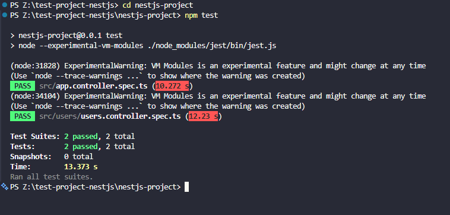
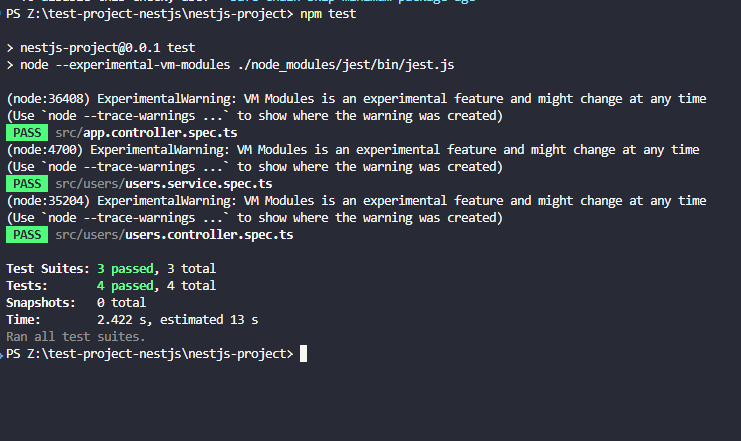

# Mocking Dependencies and Database Interacations

## how to mock dependencies using jest.mock() and NestJS’s @nestjs/testing utilities

If Nest injects the dependency into your class, create a small test module and
tell it "when the class asks for Dependencies, give it this fake object
instead", where teh fake is just an object with `jest.fn()` methods. Then in
each test, decide what those fakes return, like `mockResolvedValue({id: 1})`.

If the dependency is just something you import, like axios or fs, use
`jest.mock('axios')` to replace the whole import with a fake. If you only need
to fake one method, `jest.spyOn` is easier.

Two things trip people up: reset your mocks between tests (set clearMocks: true
in the Jest config) so one test doesn't affect the next, and if you see "Nest
can't resolve dependencies," it means you forgot to give the test module a fake
for something the class needs.

## Mock a service inside a controller test

```ts
// users.controller.spec.ts
import { Test, TestingModule } from "@nestjs/testing";
import { UsersController } from "./users.controller";
import { UsersService } from "./users.service";

describe("UsersController", () => {
  let controller: UsersController;

  const mockUsersService = {
    createUser: jest.fn(),
  };

  beforeEach(async () => {
    const module: TestingModule = await Test.createTestingModule({
      controllers: [UsersController],
      providers: [
        {
          provide: UsersService,
          useValue: mockUsersService,
        },
      ],
    }).compile();

    controller = module.get<UsersController>(UsersController);

    jest.clearAllMocks();
  });

  it("should create a user", () => {
    const userData = {
      name: "John",
      email: "john@example.com",
    };

    mockUsersService.createUser.mockReturnValue({
      message: "User received",
      data: userData,
    });

    const result = controller.createUser(userData);

    expect(mockUsersService.createUser).toHaveBeenCalledWith(userData);

    expect(result).toEqual({
      message: "User received",
      data: userData,
    });
  });
});
```

Here the real UsersService is not being used, instead the mockUserService is
being used, which creates a fake service.

```ts
const module: TestingModule = await Test.createTestingModule({
  controllers: [UsersController],
  providers: [
    {
      provide: UsersService,
      useValue: mockUsersService,
    },
  ],
});
```

here it says, if UsersService is asked for, give mockUsersService. This means
the test is specifically checking whether your controller correctly passes the
user data to the service.

**Result**

```
PS Z:\test-project-nestjs\nestjs-project> npm test

> nestjs-project@0.0.1 test
> node --experimental-vm-modules ./node_modules/jest/bin/jest.js

(node:31828) ExperimentalWarning: VM Modules is an experimental feature and might change at any time
(Use `node --trace-warnings ...` to show where the warning was created)
 PASS  src/app.controller.spec.ts (10.272 s)
(node:34104) ExperimentalWarning: VM Modules is an experimental feature and might change at any time
(Use `node --trace-warnings ...` to show where the warning was created)
 PASS  src/users/users.controller.spec.ts (12.23 s)

Test Suites: 2 passed, 2 total
Tests:       2 passed, 2 total
Snapshots:   0 total
Time:        13.373 s
Ran all test suites.
PS Z:\test-project-nestjs\nestjs-project>
```



## Mock a database repository in a service test

Added a user entity for database

```ts
import { Column, Entity, PrimaryGeneratedColumn } from "typeorm";

@Entity()
export class User {
  @PrimaryGeneratedColumn()
  id: number;

  @Column()
  name: string;

  @Column()
  email: string;
}
```

Updating the UsersService

```ts
//users.service.ts

import { Injectable } from "@nestjs/common";
import { InjectRepository } from "@nestjs/typeorm";
import { Repository } from "typeorm";
import { User } from "./entities/user.entity";

@Injectable()
export class UsersService {
  constructor(
    @InjectRepository(User)
    private readonly usersRepository: Repository<User>,
  ) {}

  async findAll() {
    return this.usersRepository.find();
  }

  async createUser(userData: { name: string; email: string }) {
    const user = this.usersRepository.create(userData);
    return this.usersRepository.save(user);
  }
}
```

Mocking the repository in the service test

```ts
//users.service.spec.ts
import { Test, TestingModule } from "@nestjs/testing";
import { getRepositoryToken } from "@nestjs/typeorm";
import { UsersService } from "./users.service";
import { User } from "./entities/user.entity";

describe("UsersService", () => {
  let service: UsersService;

  const mockUsersRepository = {
    find: jest.fn(),
    create: jest.fn(),
    save: jest.fn(),
  };

  beforeEach(async () => {
    const module: TestingModule = await Test.createTestingModule({
      providers: [
        UsersService,
        {
          provide: getRepositoryToken(User),
          useValue: mockUsersRepository,
        },
      ],
    }).compile();

    service = module.get<UsersService>(UsersService);

    jest.clearAllMocks();
  });

  describe("findAll", () => {
    it("should return all users", async () => {
      const users = [
        {
          id: 1,
          name: "John",
          email: "john@example.com",
        },
        {
          id: 2,
          name: "Jane",
          email: "jane@example.com",
        },
      ];

      mockUsersRepository.find.mockResolvedValue(users);

      const result = await service.findAll();

      expect(mockUsersRepository.find).toHaveBeenCalled();
      expect(result).toEqual(users);
    });
  });

  describe("createUser", () => {
    it("should create and save a user", async () => {
      const userData = {
        name: "John",
        email: "john@example.com",
      };

      const newUser = {
        id: 1,
        ...userData,
      };

      mockUsersRepository.create.mockReturnValue(newUser);
      mockUsersRepository.save.mockResolvedValue(newUser);

      const result = await service.createUser(userData);

      expect(mockUsersRepository.create).toHaveBeenCalledWith(userData);
      expect(mockUsersRepository.save).toHaveBeenCalledWith(newUser);
      expect(result).toEqual(newUser);
    });
  });
});
```

If `getRepositoryToken(User)` is called,the `mockUsersRepository` is passed for
testing

**Result**



```
PS Z:\test-project-nestjs\nestjs-project> npm test

> nestjs-project@0.0.1 test
> node --experimental-vm-modules ./node_modules/jest/bin/jest.js

(node:36408) ExperimentalWarning: VM Modules is an experimental feature and might change at any time
(Use `node --trace-warnings ...` to show where the warning was created)
 PASS  src/app.controller.spec.ts
(node:4700) ExperimentalWarning: VM Modules is an experimental feature and might change at any time
(Use `node --trace-warnings ...` to show where the warning was created)
 PASS  src/users/users.service.spec.ts
(node:35204) ExperimentalWarning: VM Modules is an experimental feature and might change at any time
(Use `node --trace-warnings ...` to show where the warning was created)
 PASS  src/users/users.controller.spec.ts

Test Suites: 3 passed, 3 total
Tests:       4 passed, 4 total
Snapshots:   0 total
Time:        2.422 s, estimated 13 s
Ran all test suites.
```

## When to use jest.spyOn() vs jest.fn() in mocks

Use jest.fn() to make a brand-new fake function. Use jest.spyOn() to watch or
fake a function that already exists.

jest.fn(): you're building the fake yourself, so it does nothing until you tell
it what to return. `{ provide: Repo, useValue: { findById: jest.fn() } }`

jest.spyOn(): you're taking a real object and changing one of its methods for a
test. You can undo it afterward with
mockRestore().`jest.spyOn(service, 'sendEmail').mockReturnValue(true);`

Simple rule: making a fake object from scratch means jest.fn(). Patching one
method on something real means jest.spyOn().

# Reflection

## **Why is mocking important in unit tests?**

Mocking is important because it allows individual components to be tested in
isolation. Instead of relying on real dependencies such as services or
databases, I can replace them with mock functions that return predictable
results. This makes unit tests faster, more reliable, and focused on the
specific component being tested.

## **How do you mock a NestJS provider (e.g., a service in a controller test)?**

A NestJS provider can be mocked using the `@nestjs/testing` utilities and
`useValue`. For example, I created a mock `UsersService` with
`createUser: jest.fn()` and provided it in the testing module instead of the
real service. This allowed me to test whether the controller correctly passed
data to the service without executing the service's actual logic.

## **What are the benefits of mocking the database instead of using a real one?**

Mocking the database means the tests do not require a real database connection
or existing database data. This makes the tests faster and prevents database
state or connection issues from affecting the results. It also allows me to
control the repository's responses and test how the service handles different
database results.

## **How do you decide what to mock vs. what to test directly?**

I would mock dependencies that are outside the main responsibility of the
component being tested, such as database repositories, external APIs, or other
services. The component's own logic should be tested directly. For example, when
testing a controller, I mock the service and test the controller's interaction
with it. When testing a service, I mock the database repository and test the
service's logic directly.
