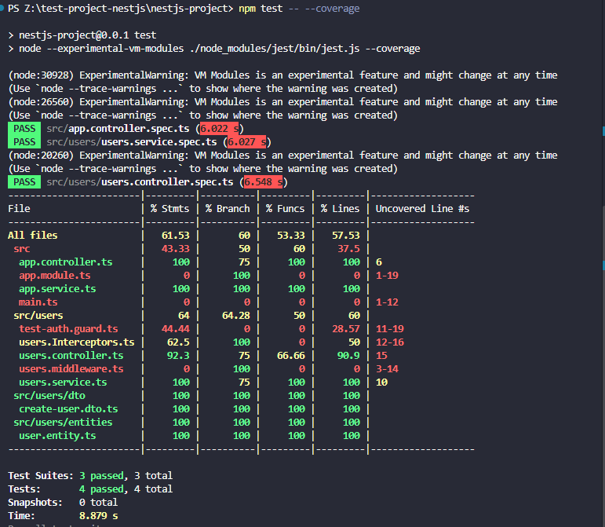
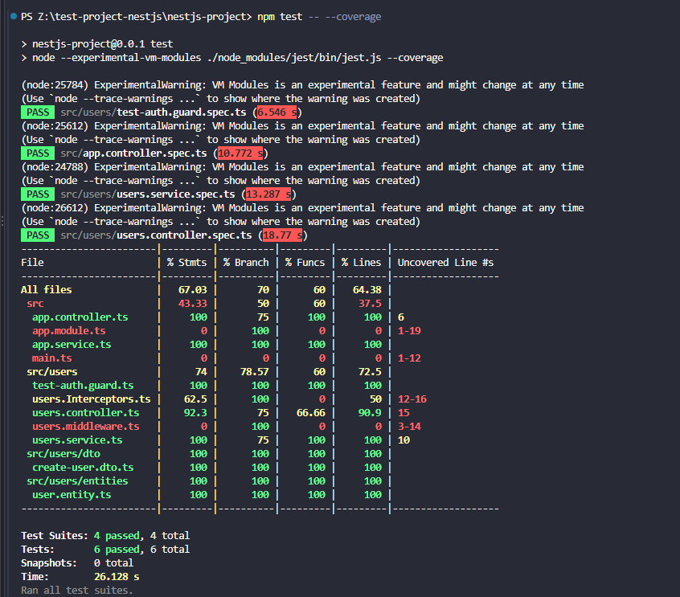

# Understanding Coverage Bar

## How Jest generates test coverage reports

Jest measures coverage by rewriting your code before the tests run. It adds tiny
counters next to every statement, function, and branch, so each time a piece of
code runs, its counter goes up. Your tests are the measurement: whatever they
execute gets counted, and whatever they don't stays at zero. When the run
finishes, Jest combines the counters from all its worker processes, uses source
maps to translate the counts back to your original TypeScript lines, and turns
the result into reports where each percentage is simply "how much ran divided by
how much exists." One catch is that files your tests never import are invisible,
so you have to tell Jest which files should count, or the report will look
better than reality. Also, NestJS decorators generate extra code behind the
scenes, which is why declarative files like modules and DTOs often get excluded
from coverage.

## Generating a Jest coverage report

you can get the coverage using the command: `npm test -- --coverage`

**Result**

| File                  | % Stmts | % Branch | % Funcs | % Lines | Uncovered Line #s |
| --------------------- | ------- | -------- | ------- | ------- | ----------------- |
| All files             | 61.53   | 60       | 53.33   | 57.53   |
| src                   | 43.33   | 50       | 60      | 37.5    |
| app.controller.ts     | 100     | 75       | 100     | 100     | 6                 |
| app.module.ts         | 0       | 100      | 0       | 0       | 1-19              |
| app.service.ts        | 100     | 100      | 100     | 100     |
| main.ts               | 0       | 0        | 0       | 0       | 1-12              |
| src/users             | 64      | 64.28    | 50      | 60      |
| test-auth.guard.ts    | 44.44   | 0        | 0       | 28.57   | 11-19             |
| users.Interceptors.ts | 62.5    | 100      | 0       | 50      | 12-16             |
| users.controller.ts   | 92.3    | 75       | 66.66   | 90.9    | 15                |
| users.middleware.ts   | 0       | 100      | 0       | 0       | 3-14              |
| users.service.ts      | 100     | 75       | 100     | 100     | 10                |
| src/users/dto         | 100     | 100      | 100     | 100     |
| create-user.dto.ts    | 100     | 100      | 100     | 100     |
| src/users/entities    | 100     | 100      | 100     | 100     |
| user.entity.ts        | 100     | 100      | 100     | 100     |



The important categories are:

- Statements — percentage of executable statements tested.
- Branches — percentage of conditional paths tested.
- Functions — percentage of functions called by tests.
- Lines — percentage of code lines executed by tests.

## Identifying untested areas and writing tests to improve coverage:

For this learning purpose, I will focus on improving only one of the files, in
order to showcase my learning.

Lets take `test-auth.guard.ts` because it has clear logic and the coverage
report only shows it is only 44.44%

Now in `test-auth.guard.spec.ts`

```ts
//test-auth.guard.spec.ts

import { ExecutionContext, UnauthorizedException } from "@nestjs/common";
import { TestAuthGuard } from "./test-auth.guard";

describe("TestAuthGuard", () => {
  let guard: TestAuthGuard;

  beforeEach(() => {
    guard = new TestAuthGuard();
  });

  it("should allow a valid test token", () => {
    const context = {
      switchToHttp: () => ({
        getRequest: () => ({
          headers: {
            authorization: "Bearer test-jwt-token",
          },
        }),
      }),
    } as ExecutionContext;

    expect(guard.canActivate(context)).toBe(true);
  });

  it("should reject an invalid token", () => {
    const context = {
      switchToHttp: () => ({
        getRequest: () => ({
          headers: {
            authorization: "Bearer wrong-token",
          },
        }),
      }),
    } as ExecutionContext;

    expect(() => guard.canActivate(context)).toThrow(UnauthorizedException);
  });
});
```

---

| File                  | % Stmts | % Branch | % Funcs | % Lines | Uncovered Line #s |
| --------------------- | ------- | -------- | ------- | ------- | ----------------- |
| All files             | 67.03   | 70       | 60      | 64.38   |
| src                   | 43.33   | 50       | 60      | 37.5    |
| app.controller.ts     | 100     | 75       | 100     | 100     | 6                 |
| app.module.ts         | 0       | 100      | 0       | 0       | 1-19              |
| app.service.ts        | 100     | 100      | 100     | 100     |
| main.ts               | 0       | 0        | 0       | 0       | 1-12              |
| src/users             | 74      | 78.57    | 60      | 72.5    |
| test-auth.guard.ts    | 100     | 100      | 100     | 100     |
| users.Interceptors.ts | 62.5    | 100      | 0       | 50      | 12-16             |
| users.controller.ts   | 92.3    | 75       | 66.66   | 90.9    | 15                |
| users.middleware.ts   | 0       | 100      | 0       | 0       | 3-14              |
| users.service.ts      | 100     | 75       | 100     | 100     | 10                |
| src/users/dto         | 100     | 100      | 100     | 100     |
| create-user.dto.ts    | 100     | 100      | 100     | 100     |
| src/users/entities    | 100     | 100      | 100     | 100     |
| user.entity.ts        | 100     | 100      | 100     | 100     |



This shows that the test-auth.guard.ts has now 100% coverage, which was improved
from 44%

## Research the concept of "meaningful test assertions" and why high coverage can sometimes be misleading

Coverage only means that code ran during a test, not that the test checked
anything. A test that calls a function and asserts nothing gives the same
coverage as a thorough test, because the counters tick up either way.

Coverage tells you what was executed, while assertions are what actually verify
behavior. A meaningful assertion checks an outcome that would change if the code
were wrong, such as the returned value, the state that changed, or the specific
error thrown. Weak ones check things that are almost always true, like
toBeDefined(), or only confirm a mock was called without checking what it was
called with.

If a test suite has high coverage but the broken code still passes, the
assertions weren't doing their job. In short, low coverage reliably tells you
something is untested, but high coverage doesn't tell you it's well tested.

## Refactor a weak test

Lets take for example, a weak test

```ts
it("should call createUser", () => {
  controller.createUser({
    name: "John",
    email: "john@example.com",
  });
});
```

The test executes the code, so it contributes to coverage, but it doesn't
actually verify anything. A bug could be introduced and the test might still
pass. **refactored**

```ts
it("should pass the user data to the service", () => {
  const userData = {
    name: "John",
    email: "john@example.com",
  };

  mockUsersService.createUser.mockReturnValue({
    message: "User received",
    data: userData,
  });

  const result = controller.createUser(userData);

  expect(mockUsersService.createUser).toHaveBeenCalledWith(userData);

  expect(result).toEqual({
    message: "User received",
    data: userData,
  });
});
```

This checks that the controller sends data to service and the service returns
expected result.

# Reflection

## **What does the coverage bar track, and why is it important?**

The coverage bar tracks how much of the code is executed by the test suite. It
can measure statements, branches, functions, and lines. This is important
because it helps identify parts of the application that have not been tested and
may contain undetected issues.

## **Why does Focus Bear enforce a minimum test coverage threshold?**

Focus Bear enforces a minimum coverage threshold to encourage developers to test
a reasonable amount of their code before changes are considered complete. This
helps reduce the risk of introducing bugs and provides greater confidence when
modifying existing functionality.

## **How can high test coverage still lead to untested functionality?**

High coverage does not necessarily mean that the tests are checking whether the
application behaves correctly. A test can execute a line of code without making
a meaningful assertion about its result. For example, a test that only calls a
function may increase coverage while failing to verify its output or side
effects.

## **What are examples of weak vs. strong test assertions?**

A weak test might only call a function without checking the result:

```ts
controller.createUser(userData);
```

A stronger test checks both the result and the interaction with a dependency:

```ts
const result = controller.createUser(userData);

expect(mockUsersService.createUser).toHaveBeenCalledWith(userData);

expect(result).toEqual({
  message: "User received",
  data: userData,
});
```

The stronger test verifies that the controller passed the correct data and
returned the expected response.

## **How can you balance increasing coverage with writing effective tests?**

I would use the coverage report to identify important untested code, then write
tests that verify meaningful behaviour rather than simply trying to execute
every line. Coverage is useful for finding gaps, but the quality of the
assertions and the different success and failure cases being tested are more
important than reaching 100% coverage.
