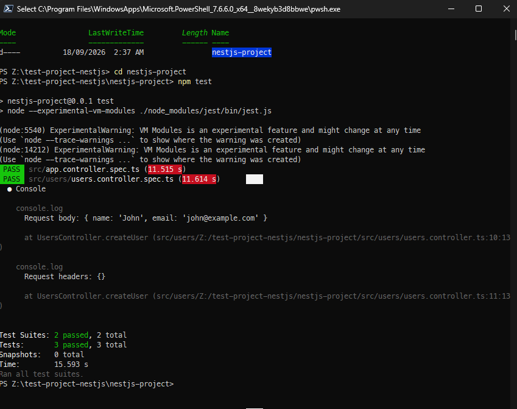

# NestJS Testing Introduction

## Testing Tasks

### Research Different Types of Testing

There are three common types of testing used in a NestJS application:

| Testing Type            | Description                                                                               | Example                                                   |
| ----------------------- | ----------------------------------------------------------------------------------------- | --------------------------------------------------------- |
| **Unit Testing**        | Tests a single component in isolation, usually with dependencies mocked.                  | Testing a method in `UsersService`.                       |
| **Integration Testing** | Tests multiple components together to make sure they work correctly.                      | Testing a controller and service together.                |
| **E2E Testing**         | Tests the application from the outside, usually by making HTTP requests to API endpoints. | Sending a `GET /users` request and checking the response. |

Unit tests generally have the smallest scope and are usually faster. Integration
tests check how different components interact, while E2E tests verify larger
parts of the application working together.

### Jest in NestJS

Jest is the testing framework commonly used by NestJS. It provides functions
such as `describe()`, `it()`, and `expect()` for creating and running tests.

For example:

```ts
describe("UsersService", () => {
  it("should be defined", () => {
    expect(service).toBeDefined();
  });
});
```

Jest also provides features such as mocking, test discovery, assertions, and
test execution.

### Using `@nestjs/testing`

NestJS provides the `@nestjs/testing` package to make it easier to test NestJS
components.

I used `Test.createTestingModule()` to create a testing module containing the
service I wanted to test:

```ts
import { Test, TestingModule } from "@nestjs/testing";
import { UsersController } from "./users.controller";

describe("UsersController", () => {
  let controller: UsersController;

  beforeEach(async () => {
    const module: TestingModule = await Test.createTestingModule({
      controllers: [UsersController],
    }).compile();

    controller = module.get<UsersController>(UsersController);
  });

  it("should be defined", () => {
    expect(controller).toBeDefined();
  });

  it("should return the user data", () => {
    const request = {
      body: {
        name: "John",
        email: "john@example.com",
      },
      headers: {},
    } as any;

    const result = controller.createUser(request);

    expect(result).toEqual({
      message: "User received",
      data: {
        name: "John",
        email: "john@example.com",
      },
    });
  });
});
```

`Test.createTestingModule()` creates a testing environment using NestJS's
dependency injection system. The service can then be retrieved using
`module.get()`.

This makes testing easier because NestJS handles the setup of the components and
their dependencies.

### Running the Jest Test

The testing file is written above and the test is being done in the following
code:

```ts
import { Controller, Post, Req, UseInterceptors } from "@nestjs/common";
import type { Request } from "express";
import { ResponseLoggerInterceptor } from "./users.Interceptors";

@Controller("users")
@UseInterceptors(ResponseLoggerInterceptor)
export class UsersController {
  @Post()
  createUser(@Req() request: Request) {
    console.log("Request body:", request.body);
    console.log("Request headers:", request.headers);

    return {
      message: "User received",
      data: request.body,
    };
  }
}
```

```ts
import {
  CallHandler,
  ExecutionContext,
  Injectable,
  NestInterceptor,
} from "@nestjs/common";
import { Observable, map } from "rxjs";

@Injectable()
export class ResponseLoggerInterceptor implements NestInterceptor {
  intercept(context: ExecutionContext, next: CallHandler): Observable<any> {
    return next.handle().pipe(
      map((data) => {
        console.log("Original response:", data);

        return {
          ...data,
          intercepted: true,
        };
      }),
    );
  }
}
```

I ran the test using:

```bash
npm test
```

Jest discovered the test file and executed the test.

The test checked whether the `UsersService` was successfully created:

```ts
expect(service).toBeDefined();
```

The test passed successfully, confirming that the service could be created in
the NestJS testing environment.



**Result**

```pwsh
PS Z:\test-project-nestjs\nestjs-project> npm test

> nestjs-project@0.0.1 test
> node --experimental-vm-modules ./node_modules/jest/bin/jest.js

(node:5540) ExperimentalWarning: VM Modules is an experimental feature and might change at any time
(Use `node --trace-warnings ...` to show where the warning was created)
(node:14212) ExperimentalWarning: VM Modules is an experimental feature and might change at any time
(Use `node --trace-warnings ...` to show where the warning was created)
 PASS  src/app.controller.spec.ts (11.515 s)
 PASS  src/users/users.controller.spec.ts (11.614 s)
  ● Console

    console.log
      Request body: { name: 'John', email: 'john@example.com' }

      at UsersController.createUser (src/users/Z:/test-project-nestjs/nestjs-project/src/users/users.controller.ts:10:13)

    console.log
      Request headers: {}

      at UsersController.createUser (src/users/Z:/test-project-nestjs/nestjs-project/src/users/users.controller.ts:11:13)


Test Suites: 2 passed, 2 total
Tests:       3 passed, 3 total
Snapshots:   0 total
Time:        15.593 s
Ran all test suites.
```

## Reflection

### What are the key differences between unit, integration, and E2E tests?

Unit tests focus on testing a small part of an application, such as a single
service or method, in isolation. Dependencies can be mocked so that the test
only focuses on the component being tested.

Integration tests test multiple components together to make sure they work
correctly as a group. For example, a controller and service can be tested
together to verify that they communicate correctly.

End-to-end (E2E) tests test the application from a higher level and are closer
to how a real client would use the system. For a NestJS API, an E2E test could
send an HTTP request to an endpoint and check the returned status code and
response.

The main difference is the scope of the test. Unit tests have the smallest
scope, integration tests cover interactions between components, and E2E tests
cover a larger part of the complete application.

### Why is testing important for a NestJS backend?

Testing is important because it helps find problems before they reach users. A
backend can contain many controllers, services, database operations, guards,
pipes, and other components, so manually checking everything after every change
would take a lot of time.

Automated tests provide a faster way to check whether existing functionality
still works after making changes. They can also make it safer to refactor code
because tests can identify when a change has broken existing behaviour.

For a NestJS backend, testing is particularly useful because the application is
normally made up of many interconnected components. Testing these components
helps verify that they behave as expected.

### How does NestJS use `@nestjs/testing` to simplify testing?

NestJS provides the `@nestjs/testing` package to make it easier to create a
testing environment that uses Nest's dependency injection system.

The `Test.createTestingModule()` method can be used to create a testing module
containing the controllers and providers needed by the test. After calling
`compile()`, the required components can be retrieved using the testing module.

For example:

```ts
const moduleRef = await Test.createTestingModule({
  providers: [UsersService],
}).compile();

const service = moduleRef.get(UsersService);
```

This means I do not have to manually create every dependency when testing a
NestJS component. NestJS also provides ways to replace providers with mock
implementations, which is useful when a component depends on things such as
databases or external services.

### What are the challenges of writing tests for a NestJS application?

One challenge is understanding which type of test should be used. Unit,
integration, and E2E tests have different purposes, so choosing the correct
level of testing is important.

Another challenge is dealing with dependencies. A service may depend on a
database, another service, or an external API. These dependencies may need to be
mocked or replaced during unit testing.

E2E tests can also require more setup because they involve more parts of the
application and may require the application to be initialized before the test
can run.

I also found that writing tests requires thinking about expected behaviour
rather than only checking whether the code runs without errors. A useful test
needs to check a specific expected result so that it can detect when the
application's behaviour changes.
