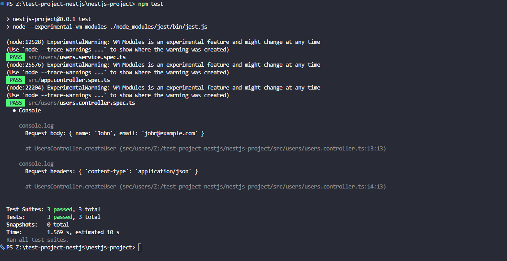

# Writing Unit Tests for Services & Controllers in NestJS

## How unit testing works in NestJS using Jest

Unit testing in NestJS is used to test individual parts of an application
independently, such as services and controllers. NestJS uses Jest as its default
testing framework and provides testing utilities through `@nestjs/testing`. Jest
provides features such as test cases, assertions, and mock functions, while
NestJS's `Test.createTestingModule()` can be used to create an isolated testing
environment with dependency injection. In my project, I created a unit test for
`UsersService` to check that it correctly processes user data. I also tested
`UsersController` separately and mocked the `UsersService` dependency using
`jest.fn()` and NestJS's `useValue` testing utility. This allows the controller
to be tested without relying on the actual service implementation. Unit testing
makes it easier to identify problems in individual components and ensures that
each part behaves as expected before the components are used together.

## Unit testing for NestJS service and controller

```ts
//users.service.ts

import { Injectable } from "@nestjs/common";

@Injectable()
export class UsersService {
  createUser(userData: any) {
    return {
      message: "User received",
      data: userData,
    };
  }
}
```

The changes made in the users controller

```ts
//users.controller.ts

import { Controller, Post, Req, UseInterceptors } from "@nestjs/common";
import type { Request } from "express";
import { ResponseLoggerInterceptor } from "./users.Interceptors";
import { UsersService } from "./users.service";

@Controller("users")
@UseInterceptors(ResponseLoggerInterceptor)
export class UsersController {
  constructor(private readonly usersService: UsersService) {}

  @Post()
  createUser(@Req() request: Request) {
    console.log("Request body:", request.body);
    console.log("Request headers:", request.headers);

    return this.usersService.createUser(request.body);
  }
}
```

Service Test

```ts
//users.service.spec.ts

import { UsersService } from "./users.service";

describe("UsersService", () => {
  let service: UsersService;

  beforeEach(() => {
    service = new UsersService();
  });

  it("should create a user", () => {
    const user = {
      name: "John",
      email: "john@example.com",
    };

    const result = service.createUser(user);

    expect(result).toEqual({
      message: "User received",
      data: user,
    });
  });
});
```

This tests the service by itself.

Changes in the controller testing

```ts
//users.controller.specs.ts

import { Test, TestingModule } from "@nestjs/testing";
import { UsersController } from "./users.controller";
import { UsersService } from "./users.service";

describe("UsersController", () => {
  let controller: UsersController;

  const mockUsersService = {
    createUser: jest.fn(),
  };

  beforeEach(async () => {
    const module: TestingModule = await Test.createTestingModule({
      controllers: [UsersController],
      providers: [
        {
          provide: UsersService,
          useValue: mockUsersService,
        },
      ],
    }).compile();

    controller = module.get<UsersController>(UsersController);
  });

  it("should create a user", () => {
    const user = {
      name: "John",
      email: "john@example.com",
    };

    mockUsersService.createUser.mockReturnValue({
      message: "User received",
      data: user,
    });

    const request = {
      body: user,
      headers: {
        "content-type": "application/json",
      },
    } as any;

    const result = controller.createUser(request);

    expect(mockUsersService.createUser).toHaveBeenCalledWith(user);

    expect(result).toEqual({
      message: "User received",
      data: user,
    });
  });
});
```

**Test Result**



```
PS Z:\test-project-nestjs\nestjs-project> npm test

> nestjs-project@0.0.1 test
> node --experimental-vm-modules ./node_modules/jest/bin/jest.js

(node:12528) ExperimentalWarning: VM Modules is an experimental feature and might change at any time
(Use `node --trace-warnings ...` to show where the warning was created)
 PASS  src/users/users.service.spec.ts
(node:25576) ExperimentalWarning: VM Modules is an experimental feature and might change at any time
(Use `node --trace-warnings ...` to show where the warning was created)
 PASS  src/app.controller.spec.ts
(node:22204) ExperimentalWarning: VM Modules is an experimental feature and might change at any time
(Use `node --trace-warnings ...` to show where the warning was created)
 PASS  src/users/users.controller.spec.ts
  ● Console

    console.log
      Request body: { name: 'John', email: 'john@example.com' }

      at UsersController.createUser (src/users/Z:/test-project-nestjs/nestjs-project/src/users/users.controller.ts:13:13)

    console.log
      Request headers: { 'content-type': 'application/json' }

      at UsersController.createUser (src/users/Z:/test-project-nestjs/nestjs-project/src/users/users.controller.ts:14:13)


Test Suites: 3 passed, 3 total
Tests:       3 passed, 3 total
Snapshots:   0 total
Time:        1.569 s, estimated 10 s
Ran all test suites.
```

I mocked the UsersService dependency using NestJS testing utilities. Instead of
using the real service, I provided a mock object containing createUser as a Jest
mock function. This allowed me to test the controller independently and verify
that it passed the request data to the service correctly. Mocking dependencies
also prevents the test from depending on external resources or the actual
implementation of the service.

## Reflection

### Why is it important to test services separately from controllers?

Testing services separately from controllers helps make sure that each part of
the application works correctly on its own. A service usually contains the main
application logic, while a controller is responsible for handling requests and
passing data to the service. By testing them separately, it is easier to
identify where a problem occurs. In my project, I tested `UsersService` directly
to check its behavior and tested `UsersController` separately by mocking the
service.

### How does mocking dependencies improve unit testing?

Mocking dependencies allows a component to be tested without relying on the
actual implementation of another component. In my controller test, I used a mock
`UsersService` with `jest.fn()`. This allowed me to check whether the controller
called the service with the correct user data without running the real service.
This makes tests more isolated and can also make them faster and easier to
control.

### What are common pitfalls when writing unit tests in NestJS?

Some common problems include forgetting to provide dependencies in the testing
module, testing too many components together, using incorrect mock
implementations, and writing tests that depend too much on implementation
details. Another issue is testing only the expected successful case and not
considering invalid or unexpected input. I also found that when my controller
was not calling the mocked service, the test failed even though the request data
was being received correctly. This showed me that the test needs to verify the
actual behavior being tested.

### How can you ensure that unit tests cover all edge cases?

I can improve test coverage by considering different inputs and possible failure
conditions instead of only testing the normal successful case. For example, for
a user creation method, I could test valid user data, missing names, missing
email addresses, empty values, and invalid data. I can also use Jest's test
coverage tools to identify parts of the code that are not being tested. Writing
separate tests for normal cases, invalid inputs, and boundary conditions helps
provide more confidence that the application behaves correctly in different
situations.
