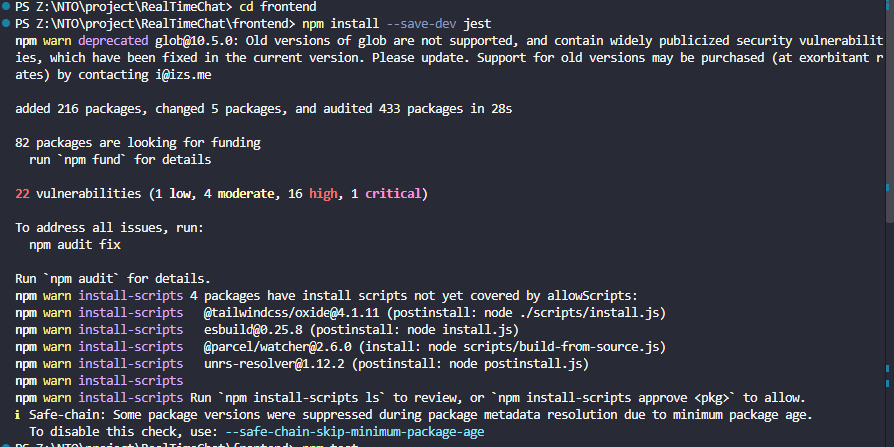
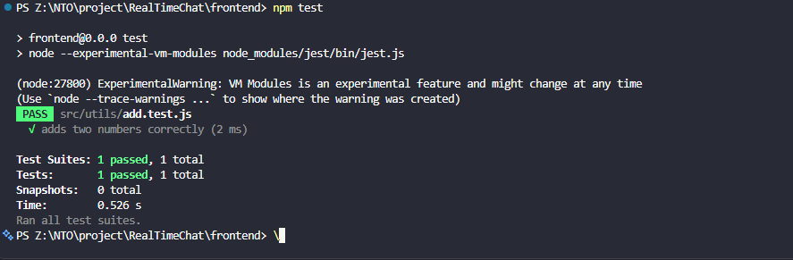
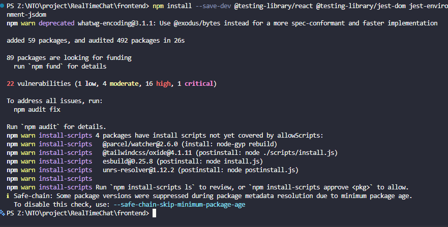
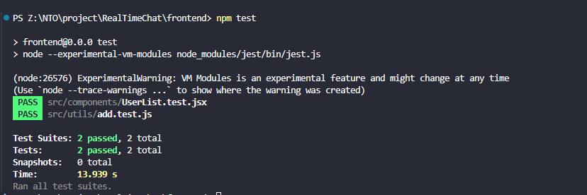

# Introduction to Unit Testing with Jest

## Setting up Jest in React project

Install using the npm package manager: `npm install --save-dev jest`

To check if it has it: use `npm list jest`



## Creating a simple utility function

```js
//src/utils/add.js

export function add(a, b) {
  return a + b;
}
```

**Test**

```js
//src/utils/add.test.js
import { add } from "./add";

test("adds two numbers correctly", () => {
  expect(add(2, 3)).toBe(5);
});
```

Run test using `npm test`



Terminal output:

```
PS Z:\NTO\project\RealTimeChat\frontend> npm test

> frontend@0.0.0 test
> node --experimental-vm-modules node_modules/jest/bin/jest.js

(node:27800) ExperimentalWarning: VM Modules is an experimental feature and might change at any time
(Use `node --trace-warnings ...` to show where the warning was created)
 PASS  src/utils/add.test.js
  √ adds two numbers correctly (2 ms)

Test Suites: 1 passed, 1 total
Tests:       1 passed, 1 total
Snapshots:   0 total
Time:        0.526 s
Ran all test suites.
PS Z:\NTO\project\RealTimeChat\frontend>
```

## Reflection

### Why is automated testing important in software development?

Automated testing is important because it allows developers to check that their
code works as expected without having to manually test everything each time.
Tests can be run repeatedly after making changes to the code, which helps detect
bugs and prevents existing functionality from accidentally breaking.

Unit tests are especially useful because they test small, individual parts of an
application, such as a utility function. This makes it easier to identify where
a problem occurs. Automated tests also provide more confidence when modifying or
adding new features because the existing tests can be run to check that the
changes have not introduced unexpected problems.

### What did you find challenging when writing your first Jest test?

The most challenging part of writing my first Jest test was understanding the
structure of the test and how `expect()` and matchers such as `toBe()` are used
to check the result. The actual test was simple once I understood the syntax.

I also had to understand how the test file should import the function being
tested and how Jest discovers test files. After running the test and seeing it
pass, the basic process became clearer.

# Mocking API Calls in Jest

Since jest is already installed, I have added React Testing Library,

`npm install --save-dev @testing-library/react @testing-library/jest-dom jest-environment-jsdom`



## For testing

```jsx
//UserList.jsx

import React, { useEffect, useState } from "react";

export function UserList() {
  const [users, setUsers] = useState([]);

  useEffect(() => {
    fetch("/api/users")
      .then((response) => response.json())
      .then((data) => {
        setUsers(data);
      });
  }, []);

  return React.createElement(
    "div",
    null,
    React.createElement("h2", null, "Users"),
    React.createElement(
      "ul",
      null,
      users.map((user) =>
        React.createElement("li", { key: user.id }, user.name),
      ),
    ),
  );
}
```

```jsx
//UserList.test.jsx

import React from "react";
import { render, screen, waitFor } from "@testing-library/react";
import { test, expect, jest } from "@jest/globals";
import { UserList } from "./UserList";

test("displays users returned by the API", async () => {
  globalThis.fetch = jest.fn(() =>
    Promise.resolve({
      json: () =>
        Promise.resolve([
          { id: 1, name: "Alice" },
          { id: 2, name: "Bob" },
        ]),
    }),
  );

  render(React.createElement(UserList));

  expect(screen.getByText("Users")).toBeTruthy();

  await waitFor(() => {
    expect(screen.getByText("Alice")).toBeTruthy();
    expect(screen.getByText("Bob")).toBeTruthy();
  });

  expect(fetch).toHaveBeenCalledWith("/api/users");
});
```

replaces the real fetch() with a fake function.

So the test does not actually contact the backend.

**Result**



```
PS Z:\NTO\project\RealTimeChat\frontend> npm test

> frontend@0.0.0 test
> node --experimental-vm-modules node_modules/jest/bin/jest.js

(node:26576) ExperimentalWarning: VM Modules is an experimental feature and might change at any time
(Use `node --trace-warnings ...` to show where the warning was created)
 PASS  src/components/UserList.test.jsx
 PASS  src/utils/add.test.js

Test Suites: 2 passed, 2 total
Tests:       2 passed, 2 total
Snapshots:   0 total
Time:        13.939 s
Ran all test suites.
```

## jest.fn() vs jest.mock()

jest.fn() is used when we want to replace a specific function with a mock.

Example:

```js
const mockFunction = jest.fn();

mockFunction("hello");

expect(mockFunction).toHaveBeenCalledWith("hello");
```

And for our API test, `global.fetch = jest.fn(...)` because fetch is the
specific function we want to control.

While jest.mock() is used to mock an entire module.

For example: `import { getUsers } from './api';`

You could mock the module using `jest.mock('./api');` and tehn provide a fake
implementation.

## Reflection

### Why is it important to mock API calls in tests?

Mocking API calls is important because unit tests should be predictable and
independent of external services. If a test makes a real API request, it could
fail because of network problems, a server being unavailable, or unexpected
changes in the API.

By mocking the API call, I can control exactly what response the component
receives. This allows me to test how the React component behaves when it
receives specific data without depending on the actual backend.

In my test, I used `jest.fn()` to replace `fetch()` with a mock function that
returned sample users. This allowed me to verify that the component displayed
the returned users correctly.

### What are some common pitfalls when testing asynchronous code?

One common problem is forgetting to wait for asynchronous operations to finish
before checking the result. For example, a component using `fetch()` does not
receive its data immediately.

Tests can also become unreliable if promises are not handled correctly or if
assertions are made before the component has finished updating.

I used `async` and `waitFor()` in my test so that Jest waits for the component
to update before checking that the users are displayed.